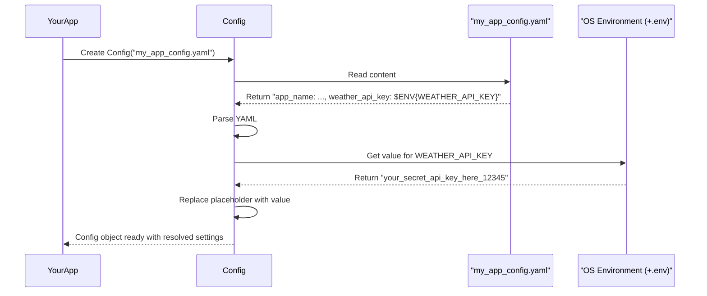
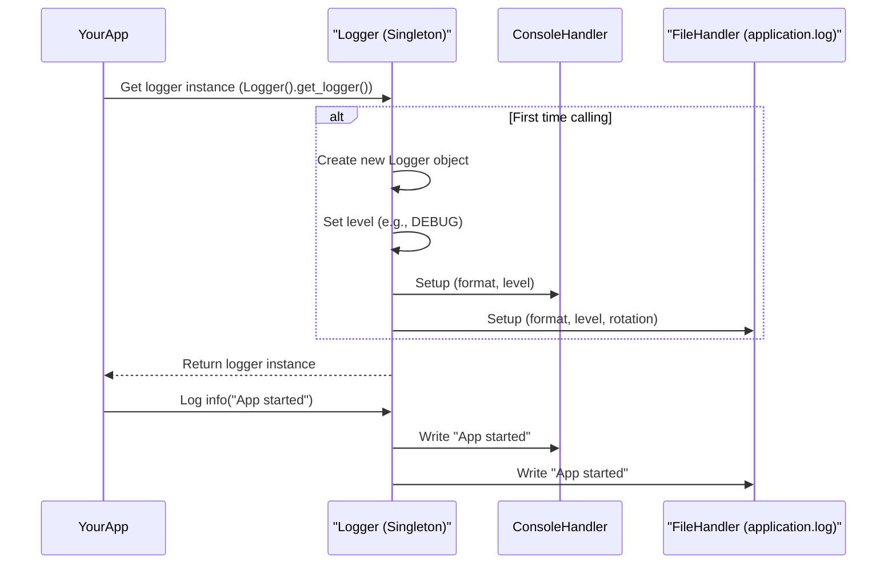

# Chapter 1: PlatformConfiguration

Welcome to your first step in understanding the `src` project! In this chapter, we'll explore **PlatformConfiguration**, the bedrock of our application.

Imagine you're building a sophisticated application, perhaps a smart assistant. This assistant needs:
1.  **Settings**: It needs to know things like your preferred language, which news sources to use, or API keys for external services.
2.  **A Record of Actions**: If the assistant tries to fetch the weather and fails, or if it successfully sets a reminder, we need a log of these events to understand what's happening, especially if something goes wrong.

This is precisely what `PlatformConfiguration` provides! It's the foundational settings and logging hub for the entire application. Think of it as the central **control panel** and **flight recorder** for an airplane:
*   The **Control Panel (`Config`)** holds all the critical settings and startup parameters, like how different parts of the application should behave.
*   The **Flight Recorder (`Logger`)** diligently notes down everything that happens, which is crucial for understanding operations and troubleshooting.

Let's dive into these two key components.

## The Control Panel: `Config`

The `Config` component is responsible for managing all the application's settings. These settings are typically stored in a human-readable file (a YAML file, in our case), making them easy to change without modifying the code.

### Why Use a Configuration File?

Imagine you have an API key for a weather service. You could write this key directly into your code. But what if the key changes? Or what if you want to share your code with someone else, but not your secret key?

A configuration file solves this. You store the API key in a separate file, and your application reads it from there.

### How `Config` Works: A Simple Example

Let's say we want our application to know its name and an API key.

1.  **Create a Settings File:**
    First, we create a YAML file named `my_app_config.yaml`:
    ```yaml
    app_name: "Awesome App v1"
    weather_api_key: "$ENV{WEATHER_API_KEY}"
    max_retries: 3
    ```
    *   `app_name` and `max_retries` are direct settings.
    *   `weather_api_key: "$ENV{WEATHER_API_KEY}"` is special. It tells `Config` to look for an environment variable named `WEATHER_API_KEY` and use its value. This is great for sensitive data like API keys.

2.  **Create a `.env` File (for environment variables):**
    Next to our Python script or in a location known to `dotenv` (like `lib/core/.env` for `config.py`), we create a file named `.env` (note the leading dot):
    ```
    WEATHER_API_KEY="your_secret_api_key_here_12345"
    ```
    This file stores our secret API key. The `Config` system (using a library called `python-dotenv`) will automatically load variables from this file into the environment when the application starts.

3.  **Load Settings in Python:**
    Now, let's see how to use `Config` in our Python code (from `lib/core/config.py`):

    ```python
    # main_program.py
    from src.lib.core.config import Config
    import os # Make sure to import os if you haven't

    # Imagine your .env file is correctly set up
    # (e.g., by ensuring dotenv loads it as in config.py)

    # 1. Initialize Config with the path to your settings file
    app_config = Config(config_file="my_app_config.yaml")

    # 2. Get all the settings
    settings = app_config.get_settings()

    # 3. Use your settings!
    print(f"Application Name: {settings.get('app_name')}")
    print(f"Weather API Key: {settings.get('weather_api_key')}")
    print(f"Max Retries: {settings.get('max_retries')}")
    ```
    **Expected Output:**
    ```
    Application Name: Awesome App v1
    Weather API Key: your_secret_api_key_here_12345
    Max Retries: 3
    ```
    See how `"$ENV{WEATHER_API_KEY}"` was replaced with the actual key from our `.env` file? That's the power of `Config`'s placeholder replacement!

### Under the Hood: `Config` Initialization

When you create a `Config` object:
1.  It's given the path to your YAML configuration file (e.g., `"my_app_config.yaml"`).
2.  It reads and parses this YAML file.
3.  It intelligently searches for placeholders like `$ENV{...}`.
4.  For each `$ENV{...}` placeholder, it fetches the corresponding value from your system's environment variables (which might have been loaded from a `.env` file).
5.  It stores the final, resolved settings, making them available via the `get_settings()` method.

Here's a simplified view of what happens:



A peek into `lib/core/config.py` shows how this is done. The `__init__` method immediately calls `load_yaml()`:

```python
# Simplified from lib/core/config.py
class Config:
    def __init__(self, config_file: str = "", ...): # Other params exist
        self.config_file = config_file
        # ... other initializations ...
        self.settings = self.load_yaml() # Load and process on creation

    def load_yaml(self) -> dict:
        try:
            with open(self.config_file, 'r', encoding='utf-8') as file:
                raw_content = file.read()
                file_data = yaml.safe_load(raw_content) # Parse text to Python dict
            # Calls internal method to replace placeholders
            settings = self._replace_placeholders_in_data(file_data)
            return settings
        # ... (error handling) ...
        return {}
```
The placeholder replacement magic happens in `_replace_placeholder()`:
```python
# Simplified from lib/core/config.py
# class Config:
    # ...
    def _replace_placeholder(self, value: str) -> str:
        if value.startswith("$ENV{") and value.endswith("}"):
            env_var = value[5:-1] # e.g., "WEATHER_API_KEY"
            # Get from environment, or keep original string if not found
            return os.getenv(env_var, value)
        # ... (it can also handle $PROMPT{...}, $TOOL{...}, etc.) ...
        return value
```
This function is called recursively for all strings within your loaded configuration data.

## The Flight Recorder: `Logger`

The `Logger` component is our application's diligent note-taker. It records important events, messages, warnings, and errors. This is invaluable for:
*   **Debugging**: When something goes wrong, logs are often the first place to look.
*   **Monitoring**: Understanding how the application is being used and performing.
*   **Auditing**: Keeping a record of significant actions.

Our `Logger` is a **singleton**. This is a fancy term meaning there's only *one* instance of the `Logger` throughout the entire application. This ensures all logs are managed centrally and consistently.

### How `Logger` Works: A Simple Example

Let's log some events from our application:

```python
# main_program.py
from src.lib.core.log import Logger

# 1. Get the logger instance.
# The Logger configures itself with defaults if not already set up.
# By default, it's named "ATHON" and logs to console and "application.log".
app_logger = Logger().get_logger()

# 2. Log messages at different severity levels
app_logger.info("Application starting up...")
app_logger.debug("Attempting to connect to weather service.") # For detailed debugging

try:
    # Let's pretend we are fetching weather
    # weather_data = fetch_weather("London") # This might fail
    raise ConnectionError("Failed to connect to weather API!") # Simulate an error
    app_logger.info("Successfully fetched weather data.")
except ConnectionError as e:
    app_logger.error(f"Weather service connection failed: {e}")

app_logger.warning("API usage approaching limit for the day.")
```

**Expected Console Output (and similar in `application.log`):**
```
2023-10-27 10:00:00,123 - ATHON - INFO - Application starting up...
2023-10-27 10:00:00,124 - ATHON - DEBUG - Attempting to connect to weather service.
2023-10-27 10:00:00,125 - ATHON - ERROR - Weather service connection failed: Failed to connect to weather API!
2023-10-27 10:00:00,126 - ATHON - WARNING - API usage approaching limit for the day.
```
(The timestamp will, of course, be the current time when you run it.)

Notice the format: `TIMESTAMP - LOGGER_NAME - LEVEL - MESSAGE`. This is configurable!

### Under the Hood: `Logger` Setup

When you first call `Logger().get_logger()`:
1.  The `LoggerSingleton` metaclass ensures only one `Logger` object is ever created.
2.  The `Logger` initializes itself using default settings (like log level 'DEBUG', log file 'application.log') or settings you might provide.
3.  It sets up "handlers":
    *   A **Console Handler**: To print logs to your screen (standard output).
    *   A **File Handler**: To write logs to a file (e.g., `application.log`). This handler is often a `RotatingFileHandler`, which means it will automatically manage log file sizes, creating backups when a file gets too big.
4.  It sets a formatter to define how log messages look.

Here's a simplified flow:


A peek into `lib/core/log.py`:
The `Logger` class uses `LoggerSingleton` as its metaclass to ensure it's a singleton.
Its `__init__` method sets up the basics:

```python
# Simplified from lib/core/log.py
class Logger(metaclass=LoggerSingleton):
    def __init__(self, config: Optional[Dict[str, Any]] = None):
        # Load configuration or use defaults (name="ATHON", level="DEBUG", etc.)
        self.config = Logger.Config(**(config or {}))
        self.logger = logging.getLogger(self.config.name)
        self.logger.setLevel(self.config.level)
        self._setup_stdout_handler() # Setup logging to console
        self._setup_file_handler()   # Setup logging to file (not shown here for brevity)

    def _setup_stdout_handler(self):
        # Create a handler for console output
        console_handler = logging.StreamHandler(sys.stdout)
        console_handler.setLevel(self.config.level)
        formatter = logging.Formatter(self.config.log_format)
        console_handler.setFormatter(formatter)
        self.logger.addHandler(console_handler)

    def get_logger(self) -> logging.LoggerAdapter:
        return logging.LoggerAdapter(self.logger, {'component_name': self.config.name})
```
When your application calls `app_logger.info("message")`, it's actually calling methods on the underlying Python `logging` object that has been configured by our `Logger` class.

## Conclusion

You've now met `PlatformConfiguration` and its two crucial parts:
*   **`Config`**: Your application's control panel, managing settings from YAML files and handling environment variable placeholders.
*   **`Logger`**: Your application's flight recorder, diligently logging events to the console and files for monitoring and debugging.

These components are foundational. Many other parts of the `src` project, like the [TemplateEngine](01_platformconfiguration_.md) (oops, this should be a different link if it were a chapter, but it uses `Logger`!) or [FileCache](01_platformconfiguration_.md) (same, uses `Logger`!), rely on `Config` for their settings and `Logger` for recording their activities.

Understanding how to define settings and check logs will be immensely helpful as you explore more complex parts of the application.

Ready to see how we handle interactions with chat services? Let's move on to the next chapter: [ChatAPIEndpoint](02_chatapiendpoint_.md).

---

Generated by [AI Codebase Knowledge Builder](https://github.com/The-Pocket/Tutorial-Codebase-Knowledge)