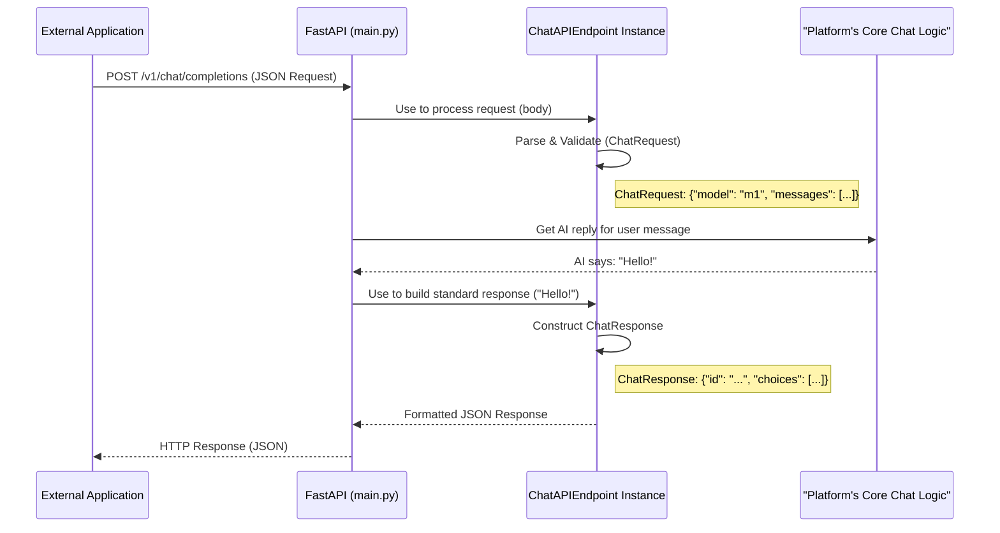

# Chapter 2: ChatAPIEndpoint

Welcome to the second chapter of our journey through the `src` project! In the [previous chapter, Chapter 1: PlatformConfiguration](01_platformconfiguration_.md), we learned about `PlatformConfiguration`, the system that manages our application's settings and logs all its important activities. It's like the control panel and flight recorder for our platform.

Now, imagine our amazing platform has some fantastic chat capabilities – maybe it can answer questions, summarize text, or even help write code. How do other applications or services talk to it? Do they need to learn a whole new, complicated way to communicate just for our platform? That wouldn't be very friendly!

This is where **`ChatAPIEndpoint`** comes to the rescue!

## What's the Big Idea with `ChatAPIEndpoint`?

Think of `ChatAPIEndpoint` as a **universal translator or adapter for conversations**. Its main job is to provide a standardized, common way for external applications to "chat" with our platform. Specifically, it offers an API (Application Programming Interface) that looks and behaves just like the one provided by OpenAI, which is a very popular standard in the world of AI.

**Use Case: Connecting a Custom Chatbot UI**

Let's say you're building a sleek web interface for a chatbot. You want this chatbot to be powered by our platform's intelligence.
*   **Without `ChatAPIEndpoint`**: Your web interface would need to know the specific, potentially unique, way our platform expects to receive chat messages and how it formats its replies. If our platform changes its internal chat logic, you might need to update your web interface too!
*   **With `ChatAPIEndpoint`**: Your web interface can simply "speak OpenAI." It sends a request in the standard OpenAI format, and our `ChatAPIEndpoint` takes care of translating that into something our platform understands. Then, it takes our platform's response and translates it *back* into the standard OpenAI format.

This makes it super easy for developers of other applications to "plug into" our platform's chat features without needing to learn custom protocols.

## Key Features of `ChatAPIEndpoint`

The `ChatAPIEndpoint` handles several important tasks:

1.  **Standard Interface**: It exposes an endpoint (like a specific web address) that accepts requests matching the OpenAI `/v1/chat/completions` API. This is great because many developers and tools are already familiar with this format.
2.  **Request Validation**: When an external application sends a chat request, `ChatAPIEndpoint` checks if the request is valid (e.g., does it include the necessary information like the message itself?).
3.  **Response Structuring**: It takes the answer generated by our platform's internal chat logic and formats it into a standard OpenAI-compatible response.
4.  **Streaming Support**: For long answers, instead of waiting for the whole response, it can send the answer back piece by piece, like how you see text appearing in real-time in many chatbots. This makes the interaction feel much faster and more responsive.
5.  **Model Listing**: It can also tell external applications which "models" (think of these as different chat personalities or capabilities our platform offers) are available.

## How Do External Applications Use It?

Since `ChatAPIEndpoint` provides an API, external applications interact with it by sending HTTP requests. Imagine it's like sending a very specific kind of message over the internet to a particular address.

Let's say our platform is running and its `ChatAPIEndpoint` is available at `http://ourplatform.com/v1/chat/completions`.

An external application might send a request (typically a `POST` request) with data like this (in JSON format):

```json
{
  "model": "our-awesome-chat-model",
  "messages": [
    {"role": "user", "content": "Hello, platform!"}
  ]
}
```
*   `model`: Specifies which of our platform's chat capabilities to use.
*   `messages`: A list of messages in the conversation so far. Here, the user is just saying "Hello, platform!".

Our platform, using `ChatAPIEndpoint`, would then process this, get a response from its core chat logic, and send back a reply, also in JSON:

```json
{
  "id": "chatcmpl-123xyz",
  "object": "chat.completion",
  "created": 1677652288,
  "model": "our-awesome-chat-model",
  "choices": [{
    "index": 0,
    "message": {
      "role": "assistant",
      "content": "Hello there, user! How can I help you today?"
    },
    "finish_reason": "stop"
  }],
  "usage": { // Information about token usage
    "prompt_tokens": 9,
    "completion_tokens": 12,
    "total_tokens": 21
  }
}
```
The external application receives this standard response and can easily display the assistant's message: "Hello there, user! How can I help you today?"

## Under the Hood: A Simplified Look

What happens when a request comes in?

1.  **Request Arrives**: An external application sends an HTTP request to our server (e.g., to the `/v1/chat/completions` path).
2.  **Server Receives**: Our web server (FastAPI, in `platform/orchestrator/main.py`) receives this request.
3.  **Routing**: FastAPI directs this request to a specific Python function designed to handle chat completions.
4.  **`ChatAPIEndpoint` in Action**: This handler function uses an instance of our `ChatEndpoint` class (from `lib/core/chat_endpoint.py`).
    *   **Parsing & Validation**: The `ChatEndpoint` instance takes the raw request data (JSON) and tries to fit it into a pre-defined structure (a Pydantic model called `ChatRequest`). This step also validates the data. If something is missing or wrong, it can signal an error. It also uses the [Logger](01_platformconfiguration_.md) we learned about in Chapter 1 to log any unexpected fields.
    *   **Getting the AI's Reply**: The server logic (in `main.py`) then communicates with the platform's core intelligence (which might involve the [ReasoningEngineFactory](03_reasoningenginefactory_.md) and [ChatModelFactory](04_chatmodelfactory_.md) – more on those later!) to generate an actual response to the user's message.
    *   **Building the Response**: Once the AI's reply is ready, the `ChatEndpoint` instance helps package this reply into a standard `ChatResponse` structure.
5.  **Sending Back**: The server sends this structured `ChatResponse` back to the external application as an HTTP response with JSON content.

Here’s a simplified diagram of this flow:



## Diving into the Code (Simplified)

Let's peek at some simplified code snippets from `lib/core/chat_endpoint.py` to see how these structures are defined.

### Representing the Incoming Request: `ChatRequest`

The `ChatEndpoint.ChatRequest` class (it's an inner class) defines what an incoming chat request should look like. It uses Pydantic, a library for data validation.

```python
# Simplified from lib/core/chat_endpoint.py
from pydantic import BaseModel, Field, ConfigDict
from typing import List, Optional, Any, Dict

# Defines a single message in the conversation
class Message(BaseModel):
    role: str  # e.g., "user", "assistant", "system"
    content: str

class ChatEndpoint:
    # ... (other parts of ChatEndpoint class) ...
    class ChatRequest(BaseModel):
        model: str  # Which AI model to use
        messages: List[Message] # The conversation history
        stream: Optional[bool] = False # Is streaming requested?
        # ... many other OpenAI fields like temperature, max_tokens exist ...

        # This allows extra fields not defined above,
        # and the @model_validator below logs them.
        model_config = ConfigDict(extra="allow")

        @model_validator(mode="before")
        @classmethod
        def warn_extra_fields(cls, values: Dict[str, Any]) -> Dict[str, Any]:
            known = cls.model_fields.keys()
            for key in values:
                if key not in known:
                    # Uses the Logger from Chapter 1!
                    logger.warning("Unexpected field in request: %s=%s", key, values[key])
            return values
```
*   `Message`: A simple structure for each message, indicating who said it (`role`) and what they said (`content`).
*   `ChatRequest`: Holds the `model` name, a `list` of `Message` objects, and an optional `stream` flag.
*   `model_config = ConfigDict(extra="allow")`: This tells Pydantic to accept requests even if they contain extra fields not explicitly defined in `ChatRequest`.
*   `warn_extra_fields`: This special method (a "validator") checks for those extra fields and logs a warning using our `logger` – a nice touch for debugging!

### Representing the Outgoing Response: `ChatResponse`

Similarly, `ChatEndpoint.ChatResponse` defines the structure of the response sent back.

```python
# Simplified from lib/core/chat_endpoint.py
# ... (Message class is the same as above) ...

class MessageResponse(BaseModel): # For the assistant's message in the response
    role: str # Will be "assistant"
    content: str

class ChatResponseChoice(BaseModel):
    index: int # Usually 0, as we typically get one response
    message: MessageResponse # The actual assistant message
    finish_reason: str = "stop" # Why the message ended (e.g., "stop", "length")

class ChatEndpoint:
    # ... (ChatRequest and other parts) ...
    class ChatResponse(BaseModel):
        id: str # A unique ID for this chat completion
        object: str = "chat.completion" # Standard OpenAI field
        created: int # Timestamp of when the response was created
        model: str # The model that generated the response
        choices: List[ChatResponseChoice] # A list of possible responses (usually one)
        usage: Dict[str, int] # Info about tokens used
```
*   `MessageResponse`: Similar to `Message`, but specifically for the assistant's reply.
*   `ChatResponseChoice`: OpenAI's API allows for multiple "choices" or alternative responses, though usually, we just provide one. It contains the `message` and a `finish_reason`.
*   `ChatResponse`: The main container, including a unique `id`, the `model` name, and a list of `choices`. It also includes `usage` data, which tells the requester how many "tokens" (pieces of words) were processed.

### The `ChatEndpoint` Class Itself

The `ChatEndpoint` class brings these models together.

```python
# Simplified from lib/core/chat_endpoint.py
import time
import uuid # For generating unique IDs
# ... (other imports like Logger, BaseModel, List, Dict, Optional) ...

class ChatEndpoint:
    class Config(BaseModel): # Configuration for ChatEndpoint itself
        available_models: List[str] = Field(
            default_factory=lambda: ["default-model-name"],
            description="List of model identifiers exposed by this endpoint."
        )
    # ... (ChatRequest and ChatResponse Pydantic models as shown before) ...

    def __init__(self, config: Optional[Dict[str, Any]] = None):
        self.config = ChatEndpoint.Config(**(config or {}))
        # self.logger = Logger().get_logger() # Logger setup

    def validate_request(self, request: "ChatEndpoint.ChatRequest") -> None:
        if not request.model:
            # In real code, this raises an HTTPException for FastAPI
            logger.error("Missing 'model' in request.")
            # raise HTTPException(status_code=400, detail="Missing 'model'...")
        if not request.messages:
            logger.error("Missing 'messages' in request.")
        logger.info(f"Validated request for model: {request.model}")

    def build_response(
        self,
        request: "ChatEndpoint.ChatRequest",
        content: Optional[str] = None # The actual AI-generated text
    ) -> "ChatEndpoint.ChatResponse":
        # Simplified: get last user message for echo, calculate dummy tokens
        user_message_content = request.messages[-1].content if request.messages else ""
        assistant_reply = content or f"Echo: {user_message_content}"

        return ChatEndpoint.ChatResponse(
            id=f"chatcmpl-{uuid.uuid4().hex}", # Unique ID
            created=int(time.time()), # Current time
            model=request.model,
            choices=[
                ChatResponseChoice(
                    index=0,
                    message=MessageResponse(role="assistant", content=assistant_reply)
                )
            ],
            usage={ # Dummy token counts for this example
                "prompt_tokens": len(user_message_content.split()),
                "completion_tokens": len(assistant_reply.split()),
                "total_tokens": len(user_message_content.split()) + len(assistant_reply.split())
            }
        )
```
*   `Config` (inner class): Holds settings for the `ChatEndpoint` itself, like the list of `available_models` it can tell others about.
*   `__init__`: Initializes the endpoint, potentially with custom configuration.
*   `validate_request()`: Performs basic checks on the `ChatRequest` data.
*   `build_response()`: Takes the original `request` and the `content` (the AI's textual reply) and constructs a `ChatResponse` object. It generates a unique ID, adds a timestamp, and structures the message.

### Tying it into the Web Server (`platform/orchestrator/main.py`)

The `ChatEndpoint` class is used within the FastAPI web application. Here's a very simplified idea of how a route handler in `main.py` might use it:

```python
# Highly simplified concept from platform/orchestrator/main.py
# from fastapi import FastAPI, Request
# from src.lib.core.chat_endpoint import ChatEndpoint # Our class

# app = FastAPI()
# # Initialize ChatEndpoint, perhaps with config from PlatformConfiguration
# chat_endpoint_config = {"available_models": ["our-awesome-chat-model"]}
# chat_api_handler = ChatEndpoint(config=chat_endpoint_config)

# @app.post("/v1/chat/completions") # This is the API path
# async def handle_chat_completions(request: Request):
#     raw_body = await request.json() # Get data from the HTTP request
    
#     # 1. Parse and validate using ChatEndpoint's ChatRequest model
#     chat_request_data = ChatEndpoint.ChatRequest(**raw_body)
#     chat_api_handler.validate_request(chat_request_data)
    
#     # 2. Get the actual AI response (this part involves other system components)
#     # For simplicity, let's pretend we just echo the last user message
#     last_user_msg = chat_request_data.messages[-1].content
#     ai_generated_content = f"Platform says: You said '{last_user_msg}'"
    
#     # 3. Build the standard response using ChatEndpoint
#     response = chat_api_handler.build_response(
#         request=chat_request_data,
#         content=ai_generated_content
#     )
#     return response # FastAPI sends this back as JSON
```
This snippet shows the web server function:
1.  Receiving the raw JSON data.
2.  Using `ChatEndpoint.ChatRequest` to parse and validate it.
3.  (In a real system, it would call complex logic to get an AI response. Here, we just echo.)
4.  Using `chat_api_handler.build_response()` to create the standardized JSON output.

## Conclusion

The `ChatAPIEndpoint` is a crucial component for making our platform accessible and developer-friendly. By adopting the familiar OpenAI API standard, it acts as a welcoming front door for any external application wanting to leverage our platform's chat capabilities. It handles the nitty-gritty of request validation, response formatting, and even supports advanced features like streaming, ensuring a smooth and consistent interaction.

We've seen how it defines clear structures for requests and responses and how it's used within our web server to manage the communication flow. This standardization is key for easy integration and a robust system.

Now that we understand how external applications can "talk" to our platform for chat, you might be wondering: how does our platform actually *think* and come up with the replies? That's where things get even more interesting! In the next chapter, we'll explore the [ReasoningEngineFactory](03_reasoningenginefactory_.md), which is central to how our platform processes requests and generates intelligent responses.

---

Generated by [AI Codebase Knowledge Builder](https://github.com/The-Pocket/Tutorial-Codebase-Knowledge)