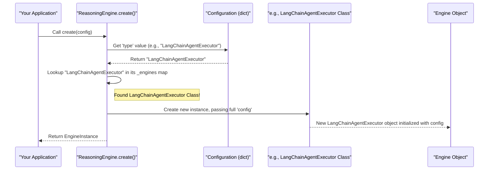

# Chapter 3: ReasoningEngineFactory

Welcome to Chapter 3! In [Chapter 2: ChatAPIEndpoint](02_chatapiendpoint_.md), we saw how external applications can communicate with our platform using a standard chat interface. We learned how requests are received and responses are formatted. But once our platform gets a user's request, how does it actually *think* and decide what to do or say? This is where the AI's "brain" comes into play, and that's what we're exploring now!

Imagine you're building an AI assistant. This assistant needs a way to process requests, make decisions, and generate responses. It's like a detective trying to solve a case. The detective receives the case (the user's request), consults their notes (memory), uses various tools (like a magnifying glass or a forensic kit), and follows a particular strategy to crack the case.

Our **`ReasoningEngineFactory`** concept is all about providing and managing these AI "brains" or "detectives."

## What is a Reasoning Engine?

A **Reasoning Engine** is the core decision-making unit for an individual AI agent. It's the "brain" that:
1.  **Receives a case**: This is the user's input or request.
2.  **Consults its notes**: This refers to using [ChatMemoryFactory](06_chatmemoryfactory_.md) to remember past parts of the conversation.
3.  **Uses available tools**: If the request requires specific actions, like searching the web or calculating something, the engine can use tools managed by [ToolManagement](07_toolmanagement_.md).
4.  **Follows a strategy**: This is defined by a system prompt (see [PromptManagement](05_promptmanagement_.md)) and the specific type of reasoning engine being used. Different engines might have different ways of thinking or problem-solving.
5.  **Formulates a response**: Based on all the above, it figures out the best course of action and generates a reply, often using a language model from [ChatModelFactory](04_chatmodelfactory_.md).

Our platform supports different reasoning strategies, such as those provided by popular frameworks like LangChain (e.g., `LangChainAgentExecutor`) or LlamaIndex (e.g., `LlamaIndexReActEngine`). Each strategy might be better suited for different kinds of tasks.

## What is the `ReasoningEngineFactory`? (And the `ReasoningEngine` Class)

You might be wondering about the "Factory" part. A "factory" in programming is a way to create objects. So, the `ReasoningEngineFactory` concept is about having a system that can create different *types* of these reasoning engines.

In our `src` project, this factory capability is primarily handled by the `ReasoningEngine` class itself, specifically through its `create` method (found in `lib/services/agents/reasoning_engine.py`).

Think of the `ReasoningEngine` class as a specialized workshop. You tell the workshop what kind of "detective" (reasoning engine) you need for a particular job, and it builds one for you.

**Why use a factory?**
*   **Flexibility**: You can easily switch between different reasoning strategies (e.g., from a LangChain-based engine to a LlamaIndex-based one) by simply changing a configuration setting.
*   **Simplicity**: Your main application code doesn't need to know the complex details of how each specific engine is built. It just asks the factory for an engine of a certain type.

## How to Get a Reasoning Engine

To get a specific reasoning engine, you'll use the static `create` method of the `ReasoningEngine` class. This method takes a configuration dictionary that tells the factory what kind of engine to build and how to set it up.

Let's look at a simplified example:

```python
# main_application_logic.py
from src.lib.services.agents.reasoning_engine import ReasoningEngine

# 1. Define the configuration for the engine
# This would typically come from a larger config file managed by PlatformConfiguration
langchain_engine_config = {
    "type": "LangChainAgentExecutor", # Tells the factory WHICH engine to build
    "system_prompt": "You are a helpful assistant.",
    "model": {"type": "OpenAIModel", "api_key": "YOUR_API_KEY"}, # Config for ChatModelFactory
    "memory": {"type": "ConversationBufferMemory", "memory_key": "chat_history"}, # Config for ChatMemoryFactory
    "tools": {"type": "DefaultToolRepository"}, # Config for ToolManagement
    "verbose": True
}

# 2. Ask the ReasoningEngine class (our factory) to create an engine
try:
    my_langchain_detective = ReasoningEngine.create(config=langchain_engine_config)
    print(f"Successfully created a {langchain_engine_config['type']}!")
    # Now, my_langchain_detective is ready to process requests using its run() method.
    # For example: result = my_langchain_detective.run("Hello, who are you?")
except ValueError as e:
    print(f"Error creating engine: {e}")
```

**What happened here?**
1.  We created a `langchain_engine_config` dictionary. The most important key here is `"type": "LangChainAgentExecutor"`. This tells the `ReasoningEngine` factory *which specific blueprint* to use for building our AI's brain.
2.  The other keys like `"system_prompt"`, `"model"`, `"memory"`, and `"tools"` provide further instructions on how this specific brain should be configured. These will be passed along to other factories and managers like [ChatModelFactory](04_chatmodelfactory_.md), [ChatMemoryFactory](06_chatmemoryfactory_.md), and [ToolManagement](07_toolmanagement_.md).
3.  We called `ReasoningEngine.create(config=langchain_engine_config)`.
4.  If successful, `my_langchain_detective` now holds an instance of `LangChainAgentExecutor`, ready to work!

If we wanted a LlamaIndex-based engine, we would just change the `type` in the config:
```python
# main_application_logic.py (continued)
llamaindex_engine_config = {
    "type": "LlamaIndexReAct", # Different type of detective!
    "system_prompt": "You are a concise assistant.",
    "model": {"type": "OpenAIModel", "api_key": "YOUR_API_KEY"},
    "memory": {"type": "SimpleChatMemory"}, # LlamaIndex might use different memory types
    "tools": {"type": "DefaultToolRepository"},
    "stateless": False # Some engines might have unique flags
}

try:
    my_llamaindex_detective = ReasoningEngine.create(config=llamaindex_engine_config)
    print(f"Successfully created a {llamaindex_engine_config['type']}!")
except ValueError as e:
    print(f"Error creating engine: {e}")
```
The rest of our application code that *uses* the detective (e.g., calls its `run` method) might not even need to change, as long as both types of detectives adhere to a common way of being operated (which they do, thanks to the `BaseReasoningEngine` we'll see next).

## Under the Hood: How the Factory Works

Let's peek behind the curtain to see what happens when you call `ReasoningEngine.create()`.

1.  **Receive Request**: Your application calls `ReasoningEngine.create(config)`.
2.  **Check Type**: The `create` method looks inside the `config` dictionary for the `type` key (e.g., `"LangChainAgentExecutor"`).
3.  **Find Blueprint**: The `ReasoningEngine` class has an internal "catalog" (a Python dictionary named `_engines`) that maps these type names to the actual Python classes that define each specific engine (e.g., `LangChainAgentExecutor` class, `LlamaIndexReActEngine` class).
4.  **Build Engine**: If it finds a matching class in its catalog, it creates a new instance (an object) of that class. Crucially, it passes the *entire* `config` dictionary to the constructor of that specific engine class.
5.  **Return Engine**: The newly created engine object is returned to your application.

Here's a simplified diagram:



### Code Dive: `ReasoningEngine` Class

Let's look at the `ReasoningEngine` class from `lib/services/agents/reasoning_engine.py`:

```python
# Simplified from lib/services/agents/reasoning_engine.py
from typing import Type, Dict, Any
# These are the actual classes for specific engine types
from src.lib.services.agents.reasoning_engines.langchain.agent_executor import (
    LangChainAgentExecutor)
from src.lib.services.agents.reasoning_engines.llamaindex.react import (
    LlamaIndexReActEngine)

class ReasoningEngine: # This class acts as our factory
    # The "_engines" catalog: maps type string to actual class
    _engines: Dict[str, Type] = {
        'LangChainAgentExecutor': LangChainAgentExecutor,
        'LlamaIndexReAct': LlamaIndexReActEngine,
        # ... other engine types could be added here
    }

    @staticmethod # Means you call it on the class: ReasoningEngine.create()
    def create(config: dict) -> Any: # Returns an instance of some engine
        engine_type = config.get('type')
        if not engine_type:
            raise ValueError("Configuration must include 'type'.")

        engine_class = ReasoningEngine._engines.get(engine_type)
        if not engine_class:
            raise ValueError(f"Unsupported engine type: {engine_type}")

        # This is where the magic happens:
        # Create an instance of the found class, passing the config to it.
        return engine_class(config)
```
*   `_engines`: This dictionary is the heart of the factory. It maps a string like `'LangChainAgentExecutor'` to the actual Python class `LangChainAgentExecutor`.
*   `create(config)`: This static method does the work. It gets the `type` from the `config`, looks up the corresponding class in `_engines`, and then creates an instance of that class by calling `engine_class(config)`.

### The Blueprint: `BaseReasoningEngine`

All specific reasoning engines (like `LangChainAgentExecutor` or `LlamaIndexReActEngine`) are built from a common blueprint. This blueprint is an "abstract base class" called `BaseReasoningEngine` (from `lib/services/agents/reasoning_engines/base.py`).

```python
# Simplified from lib/services/agents/reasoning_engines/base.py
import abc # Stands for Abstract Base Class
from pydantic import BaseModel, Field
from typing import Optional, Any, Dict, List

class BaseReasoningEngine(abc.ABC):
    # Inner class to define expected configuration structure
    class Config(BaseModel):
        type: str
        system_prompt: str
        model: Dict[str, Any] # Config for the ChatModel
        memory: Dict[str, Any] # Config for ChatMemory
        tools: Dict[str, Any]  # Config for Tools
        verbose: Optional[bool] = False
        # ... other common fields ...

    # Inner class to define expected result structure
    class Result(BaseModel):
        status: str = "success"
        completion: Optional[str] = None
        error_message: Optional[str] = None

    @abc.abstractmethod # Means specific engines MUST implement this
    def run(self, messages: Any) -> 'BaseReasoningEngine.Result':
        pass # Actual logic is in specific engines

    # ... other abstract methods like clear_memory, set_tools ...
```
*   **`Config` (Pydantic Model)**: This defines the common structure for the configuration that all reasoning engines expect. When `ReasoningEngine.create(config)` calls `engine_class(config)`, the specific engine (e.g., `LangChainAgentExecutor`) will use this `Config` model to parse and validate its portion of the overall configuration. This ensures that essential pieces of information like `system_prompt`, `model` configuration, `memory` configuration, and `tools` configuration are consistently available.
*   **`Result` (Pydantic Model)**: Defines a standard way for engines to report their outcome.
*   **`run(self, messages: Any)`**: This is an abstract method. It means `BaseReasoningEngine` doesn't say *how* to run, only that every *specific* reasoning engine *must* provide its own `run` method. This is how the AI actually processes the input messages.

### A Specific Engine: `LangChainAgentExecutor` (Brief Look)

When `ReasoningEngine.create()` calls, for example, `LangChainAgentExecutor(config)`, the `__init__` method of `LangChainAgentExecutor` gets executed:

```python
# Simplified from lib/services/agents/reasoning_engines/langchain/agent_executor.py
# ... (imports including BaseReasoningEngine, Logger, ChatModel, ChatMemory, ToolRepository) ...

class LangChainAgentExecutor(BaseReasoningEngine):
    def __init__(self, config: Dict[str, Any]):
        super().__init__() # Initialize the base class
        # Use the Config model from BaseReasoningEngine (or its own more specific one)
        # to parse and validate the received config.
        self.config = LangChainAgentExecutor.Config(**config) # Pydantic validation happens here!
        # self.logger = Logger().get_logger() # Uses the Logger from Chapter 1!

        # Now, self.config holds validated settings. The engine uses these
        # to initialize its components:
        # self.engine['model'] = self._init_model(self.config.model)
            # -> This would use ChatModel.create(self.config.model) from ChatModelFactory
        # self.engine['memory'] = self._init_memory(self.config.memory)
            # -> This would use ChatMemory.create(self.config.memory) from ChatMemoryFactory
        # self.engine['tools'] = self._get_tools()
            # -> This would use ToolRepository.create(self.config.tools) from ToolManagement
        # ... and so on, setting up the prompt, agent, and executor ...
        logger.info(f"LangChainAgentExecutor initialized with type: {self.config.type}")
```
*   The `__init__` method takes the `config` dictionary passed by the `ReasoningEngine.create()` method.
*   It uses its own `Config` Pydantic model (which inherits from or is similar to `BaseReasoningEngine.Config`) to parse this dictionary. This ensures all necessary settings are present and valid.
*   It then uses these settings to set itself up. For instance, it will use the `model` part of its configuration to create a language model (likely using the [ChatModelFactory](04_chatmodelfactory_.md)), the `memory` part to set up conversation memory (using [ChatMemoryFactory](06_chatmemoryfactory_.md)), and so on.
*   Notice the use of `logger`! This demonstrates how components use the [PlatformConfiguration](01_platformconfiguration_.md)'s logging capabilities.

## Conclusion

The `ReasoningEngineFactory` (implemented via the `ReasoningEngine` class and its `create` method) is a powerful concept that allows our platform to be flexible and organized. It acts as a central workshop for building different kinds of AI "brains" (reasoning engines), each with its own strategy (like LangChain or LlamaIndex based).

By simply changing a configuration, we can switch the entire reasoning strategy of an AI agent, without needing to rewrite large parts of our application. This is possible because all engines are built from a common blueprint (`BaseReasoningEngine`) and are created through a consistent factory mechanism. This factory takes care of passing the necessary settings for the engine's core components, such as its language model, memory, and tools.

We've seen how this factory takes a configuration, selects the right engine class, and instantiates it. Now that we understand how an AI agent's "brain" is selected and assembled, we need to look at one of its most vital components: the language model itself. How does the AI get its ability to understand and generate text? That's what we'll explore in the next chapter on [ChatModelFactory](04_chatmodelfactory_.md).

---

Generated by [AI Codebase Knowledge Builder](https://github.com/The-Pocket/Tutorial-Codebase-Knowledge)