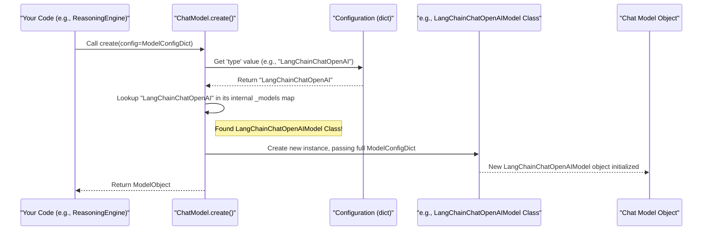

# Chapter 4: ChatModelFactory

Welcome to Chapter 4! In the [previous Chapter 3: ReasoningEngineFactory](03_reasoningenginefactory_.md), we learned about the `ReasoningEngineFactory`, which is like a workshop that builds the "brains" or "detectives" for our AI. These "brains" are responsible for thinking and making decisions. But how do these brains actually *communicate*? How do they understand human language and generate responses? They need a specialized tool for that – a way to interact with powerful language models. That's where our `ChatModelFactory` comes in!

## Picking the Right Translator: The Role of `ChatModelFactory`

Imagine you have an important document that needs to be translated. You might have several translators on your team: one specializes in OpenAI's style, another in Google's Gemini, and perhaps a third in Anthropic's Claude. Depending on the task, budget, or desired nuance, you'd want to pick the best translator for the job.

The **`ChatModelFactory`** is like the project manager in charge of these translators. Its job is to:
1.  Know which "translators" (Large Language Models or LLMs) are available.
2.  Based on your instructions (a configuration), select the right translator.
3.  Provide you with that translator, ready to work.

This system ensures our platform can flexibly switch between or use various LLM providers without needing to rewrite major parts of our application every time we want to try a new LLM or change our preferred one.

**Use Case: Summarizing Text with Different LLMs**

Let's say our application needs a feature to summarize long articles.
*   Initially, we might want to use an OpenAI model (like GPT-3.5) because it's widely available.
*   Later, we hear that Google's Gemini model provides excellent summaries, so we want to try that.
*   Or perhaps for certain types of summaries, Anthropic's Claude model is better.

Without a `ChatModelFactory`, switching between these would mean changing the code that directly calls OpenAI's API to code that calls Google's API, then Anthropic's, and so on. This would be messy and error-prone!

With `ChatModelFactory`, we simply change a configuration setting, and the factory handles giving us the correct "translator" (LLM instance) for the task. The rest of our summarization logic can remain the same.

## What is a Chat Model?

In this context, a "Chat Model" refers to an instance of a specific Large Language Model that can understand and generate text, usually in a conversational way. Think of it as:
*   An "OpenAI GPT-3.5 translator instance."
*   A "Google Gemini Pro translator instance."
*   An "Anthropic Claude Sonnet translator instance."

Each of these is a distinct software component that takes your text input (a "prompt"), processes it using its underlying AI, and gives you back a text output (a "completion" or "response").

## The Factory Itself: `ChatModel` Class and its `create` Method

In our `src` project, the role of the `ChatModelFactory` is primarily fulfilled by the `ChatModel` class (located in `lib/services/chat/model.py`) and its static method `create()`.

This `ChatModel.create()` method is the "project manager" we talked about. You give it a configuration telling it which "translator" you need, and it returns a ready-to-use instance of that translator.

## How to Get a Chat Model

Let's see how you'd ask the factory for a specific chat model.

1.  **Prepare the Configuration:**
    First, you need to tell the factory what kind of model you want and any specific settings it needs (like an API key). This is done with a Python dictionary. This configuration would typically be part of a larger settings file managed by [PlatformConfiguration](01_platformconfiguration_.md).

    Here's an example configuration if we want to use an OpenAI model via the LangChain framework:
    ```python
    # Configuration for an OpenAI model
    openai_llm_config = {
        "type": "LangChainChatOpenAI",  # Tells the factory WHICH model type
        "api_key": "$ENV{OPENAI_API_KEY}", # Your secret API key (from environment)
        "model_name": "gpt-3.5-turbo",   # Specific OpenAI model
        "temperature": 0.7              # Controls creativity
    }
    ```
    *   `"type"`: This is crucial! It's the unique name the factory uses to identify the blueprint for the model you want.
    *   `"api_key"`: Most LLMs require an API key for access. Here, we're using a placeholder that `Config` (from [Chapter 1: PlatformConfiguration](01_platformconfiguration_.md)) would resolve from an environment variable.
    *   `"model_name"`: Specifies which particular version of the LLM to use (e.g., "gpt-3.5-turbo", "gemini-pro").
    *   `"temperature"`: A common LLM setting; higher values mean more creative/random responses.

2.  **Ask the Factory to Create the Model:**
    Now, you pass this configuration to the `ChatModel.create()` method:

    ```python
    from src.lib.services.chat.model import ChatModel
    # Assume openai_llm_config is defined as above
    # and OPENAI_API_KEY is set in your environment or .env file

    try:
        # The factory creates the specific model instance
        my_openai_model = ChatModel.create(config=openai_llm_config)
        print("Successfully created an OpenAI model instance!")
        
        # Now, my_openai_model is ready to be used.
        # For example, a Reasoning Engine could use it like this:
        # response = my_openai_model.invoke("Hello, who are you?")
        # print(f"Model says: {response.content}")
        
    except ValueError as e:
        print(f"Error creating chat model: {e}")
    ```
    If successful, `my_openai_model` will hold an object that knows how to talk to OpenAI's GPT-3.5-turbo. You can then use its methods (like `invoke()`) to send prompts and get responses.

    If you wanted to switch to a Google Gemini model, you'd just provide a different configuration:
    ```python
    google_llm_config = {
        "type": "LangChainChatGoogleGenAI", # Different type!
        "api_key": "$ENV{GOOGLE_API_KEY}",
        "model_name": "gemini-pro"
    }
    # my_google_model = ChatModel.create(config=google_llm_config)
    ```
    The call to `ChatModel.create()` stays the same! This is the power of the factory pattern.

## Under the Hood: How the Factory Works

What happens when you call `ChatModel.create(config)`?

1.  **Receive Request**: Your application (or another part of `src`, like a [ReasoningEngineFactory](03_reasoningenginefactory_.md) component) calls `ChatModel.create()` with your configuration dictionary.
2.  **Identify Type**: The `create()` method looks at the `"type"` key in your `config` (e.g., `"LangChainChatOpenAI"`).
3.  **Consult Catalog**: `ChatModel` has an internal "catalog" – a Python dictionary named `_models`. This catalog maps type names (like `"LangChainChatOpenAI"`) to the actual Python classes that know how to implement that specific model (e.g., `LangChainChatOpenAIModel` class).
4.  **Instantiate Model Class**: If it finds a matching class in its catalog, it creates a new instance (an object) of that class. Importantly, it passes the *entire* `config` dictionary to the constructor of that specific model class.
5.  **Return Model Instance**: The newly created, configured chat model object is returned to your application.

Here's a simplified diagram of this flow:



### Code Dive: The `ChatModel` Factory Class

Let's look at the `ChatModel` class from `lib/services/chat/model.py`. This is our factory.

```python
# Simplified from lib/services/chat/model.py
from typing import Type, Dict, Any
# Import the actual classes for specific model types
from src.lib.services.chat.models.langchain.chat_openai import (
    LangChainChatOpenAIModel)
from src.lib.services.chat.models.langchain.chat_google_genai import (
    LangChainChatGoogleGenAIModel)
# ... other model imports like Anthropic, MistralAI, etc.

class ChatModel:  # This class acts as our factory
    # The "_models" catalog: maps type string to actual Python class
    _models: Dict[str, Type] = {
        'LangChainChatOpenAI': LangChainChatOpenAIModel,
        'LangChainChatGoogleGenAI': LangChainChatGoogleGenAIModel,
        # 'LangChainChatAnthropic': LangChainChatAnthropicModel,
        # ... other supported model types would be listed here
    }

    @staticmethod # Call it on the class: ChatModel.create()
    def create(config: dict) -> Any: # Returns an instance of some chat model
        model_type = config.get('type')
        if not model_type:
            raise ValueError("Configuration must include 'type' for ChatModel.")

        model_class = ChatModel._models.get(model_type)
        if not model_class:
            raise ValueError(f"Unsupported chat model type: {model_type}")

        # Create an instance of the found class, passing the config to it.
        return model_class(config)
```
*   `_models`: This dictionary is the "catalog" we mentioned. It maps a string like `'LangChainChatOpenAI'` to the Python class `LangChainChatOpenAIModel` that handles OpenAI interactions.
*   `create(config)`: This static method does the main work.
    1.  It gets the `type` from the `config`.
    2.  It looks up the corresponding class in `_models`.
    3.  It then creates an instance of that class by calling `model_class(config)`, passing the configuration dictionary directly to the specific model's constructor.

### The Blueprint: `BaseChatModel`

All specific chat model classes (like `LangChainChatOpenAIModel` or `LangChainChatGoogleGenAIModel`) are built from a common blueprint. This blueprint is an "abstract base class" called `BaseChatModel` (from `lib/services/chat/models/base.py`). It ensures all our "translators" have a consistent way to be configured and used.

```python
# Simplified from lib/services/chat/models/base.py
import abc # Stands for Abstract Base Class
from pydantic import BaseModel, Field # For structured configuration
from typing import Optional, Any

class BaseChatModel(abc.ABC):
    # Inner class to define expected configuration structure using Pydantic
    class Config(BaseModel):
        type: str = Field(..., description="Type of the model.")
        api_key: str = Field(..., description="API key for the model.")
        model_name: Optional[str] = Field(None, description="Name of the model.")
        temperature: Optional[float] = Field(None, description="Model temperature.")
        # ... other common fields ...

    # Inner class to define expected result structure from an invoke call
    class Result(BaseModel):
        status: str = "success"
        content: Optional[str] = None # The LLM's text response
        error_message: Optional[str] = None
        # ... other result fields like metadata, model instance ...
        
    @abc.abstractmethod # Means specific models MUST implement this
    def invoke(self, message: Any) -> 'BaseChatModel.Result':
        """The main method to get a response from the LLM."""
        pass # Actual logic is in specific model classes (e.g., LangChainChatOpenAIModel)

    @abc.abstractmethod
    def get_model(self) -> Any:
        """Returns the underlying LLM library's model instance."""
        pass
```
*   **`Config` (Pydantic Model)**: This inner class defines the common settings all chat models are expected to understand (like `type`, `api_key`, `model_name`). When a specific model like `LangChainChatOpenAIModel` is created, it uses this (or an extended version) to parse and validate its part of the configuration dictionary passed by the factory.
*   **`Result` (Pydantic Model)**: Defines a standard structure for what the `invoke` method should return, including the generated `content` and status.
*   **`invoke(self, message: Any)`**: This is an abstract method. `BaseChatModel` itself doesn't know *how* to talk to OpenAI or Google. It just declares that any *concrete* chat model class *must* provide its own `invoke` method. This is the method you'd call to send a prompt to the LLM and get a response.
*   **`get_model()`**: Another abstract method, often used to retrieve the actual model object from the underlying library (e.g., the LangChain `ChatOpenAI` object).

### A Specific Model: `LangChainChatOpenAIModel` (Brief Look)

When `ChatModel.create()` calls, for example, `LangChainChatOpenAIModel(config)`, the `__init__` method of `LangChainChatOpenAIModel` (from `lib/services/chat/models/langchain/chat_openai.py`) gets executed:

```python
# Simplified from lib/services/chat/models/langchain/chat_openai.py
import os
from langchain_openai import ChatOpenAI # The actual LangChain class for OpenAI
from src.lib.core.log import Logger # From Chapter 1
from src.lib.services.chat.models.base import BaseChatModel # Our blueprint
from typing import Dict, Any, Optional

logger = Logger().get_logger() # Get the central logger

class LangChainChatOpenAIModel(BaseChatModel): # Implements the blueprint
    # Can extend the base Config with fields specific to OpenAI
    class Config(BaseChatModel.Config):
        base_url: Optional[str] = None # e.g., for self-hosted OpenAI-compatible models
        # ... other OpenAI specific fields ...

    def __init__(self, config_dict: Dict[str, Any]):
        # Validate and store the configuration using its Pydantic Config model
        self.config = LangChainChatOpenAIModel.Config(**config_dict)
        # self.result = LangChainChatOpenAIModel.Result() # Prepare a result object
        
        # Set environment variable for LangChain (common practice)
        os.environ["OPENAI_API_KEY"] = self.config.api_key
        
        # Initialize the actual LangChain ChatOpenAI model
        # args = self._init_model_arguments() # Prepare args like model_name, temp
        # self.model = ChatOpenAI(**args) 
        logger.info(f"LangChainChatOpenAIModel for '{self.config.model_name}' initialized.")

    # ... ( _init_model_arguments() method would be here) ...

    def invoke(self, message: str) -> 'BaseChatModel.Result':
        # result_obj = self.result # Re-use or create new result
        # try:
        #   response = self.model.invoke(message) # THE ACTUAL CALL TO OPENAI VIA LANGCHAIN
        #   result_obj.content = response.content
        #   result_obj.status = "success"
        #   logger.debug(f"OpenAI call successful, content: {response.content[:50]}...")
        # except Exception as e:
        #   result_obj.status = "failure"
        #   result_obj.error_message = str(e)
        #   logger.error(f"Error invoking OpenAI model: {e}")
        # return result_obj
        pass # Implementation details omitted for brevity
```
*   The `__init__` method receives the `config_dict` from the factory.
*   It uses its own `Config` Pydantic model (which inherits/extends `BaseChatModel.Config`) to parse this dictionary, ensuring all necessary settings (like `api_key` and `model_name`) are present and valid for *this specific model*.
*   It then performs any setup required to use the OpenAI model, such as setting environment variables and initializing the `ChatOpenAI` object from the LangChain library with the provided settings.
*   Notice the use of `logger`! This demonstrates how components use the `Logger` from [Chapter 1: PlatformConfiguration](01_platformconfiguration_.md) to record important events, like successful initialization or errors during API calls.
*   The `invoke` method (whose details are simplified here) would contain the actual code to send the `message` to the initialized `ChatOpenAI` model and package the response into the standard `BaseChatModel.Result` format.

This pattern is repeated for other models like `LangChainChatGoogleGenAIModel` or `LlamaIndexOpenAIModel`, each handling the specifics of its respective LLM provider and library.

## Conclusion

The `ChatModelFactory` (implemented via the `ChatModel.create()` method) is a cornerstone for flexibility in our `src` project. It acts as a central dispatcher, allowing us to easily select and instantiate different Large Language Models from various providers (OpenAI, Google, Anthropic, etc.) just by changing a configuration.

You've learned:
*   Why we need a factory for chat models: to avoid hardcoding specific LLM providers and easily switch between them.
*   How to configure and request a specific chat model using `ChatModel.create()`.
*   The internal workings: a catalog (`_models`) maps type names to specific model classes.
*   The role of the `BaseChatModel` blueprint in ensuring consistency across different model implementations.
*   How specific model classes (e.g., `LangChainChatOpenAIModel`) handle the unique details of their LLM provider.

This abstraction means that higher-level components, like the "reasoning engines" we discussed in the previous chapter, don't need to worry about the nitty-gritty details of each LLM's API. They just ask the factory for a "translator" of a certain type, and they get one, ready to go!

Now that we know how to get a powerful "translator" (an LLM instance), how do we give it the best possible instructions to get the results we want? That's all about crafting effective "prompts." Let's dive into that in our next chapter: [Chapter 5: PromptManagement](05_promptmanagement_.md).

---

Generated by [AI Codebase Knowledge Builder](https://github.com/The-Pocket/Tutorial-Codebase-Knowledge)