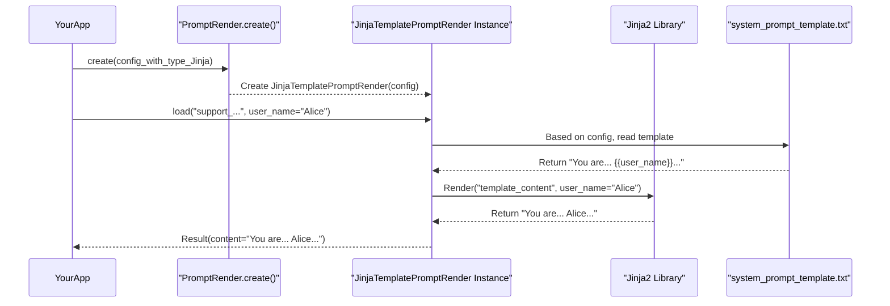
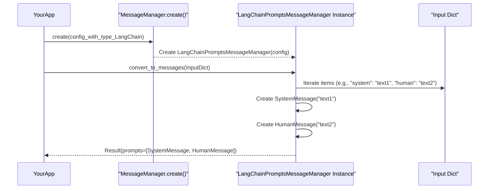

# Chapter 5: PromptManagement

Welcome to Chapter 5! In [Chapter 4: ChatModelFactory](04_chatmodelfactory_.md), we discovered how our platform can access powerful "translators" – Large Language Models (LLMs) like GPT or Gemini – that understand and generate human language. We learned how `ChatModelFactory` helps us pick the right LLM for the job.

But having a powerful translator isn't enough. We need to give it clear and effective instructions. If you tell a translator, "Translate this, sort of," you might not get a good result. You need to be specific! This is where **PromptManagement** comes in.

## What's the Big Deal with Prompts?

Imagine you're building an AI customer support agent. You want this agent to:
1.  Always be polite and helpful.
2.  Introduce itself clearly.
3.  Remember the customer's name if they've provided it.
4.  Understand its role as a "Support Assistant for 'AwesomeApp'."

Simply telling the LLM "answer the user" won't achieve this. We need to *prompt* it carefully. A **prompt** is the set of instructions and context we give to an LLM to guide its behavior and responses.

**PromptManagement** is all about creating, organizing, and delivering these instructions effectively. It involves two key players:
*   **`PromptRender`**: Think of this as a smart mail-merge tool. It takes a template for your instructions and fills in the blanks with specific details.
*   **`MessageManager`**: This is like a conversation secretary. It makes sure the instructions and the ongoing chat are formatted in a way the LLM can perfectly understand, especially when dealing with conversation history or specific LLM API requirements.

Let's see how these help our support agent!

## `PromptRender`: Crafting Dynamic Instructions

Our support agent needs a "system prompt" – an initial set of instructions that defines its personality and role. We want this to be dynamic. For example, it should greet the user by name if we know it.

This is where `PromptRender` shines. It uses templates (often written in a language like Jinja) to create these dynamic prompts.

**1. Create a Prompt Template:**
Let's say we have a template file, maybe `system_prompt_template.txt`:
```jinja
You are a friendly and helpful Support Assistant for 'AwesomeApp'.
Your name is AthonBot.

The user's name is {{ user_name }}. Please greet them by name.

Please assist the user with their query.
```
*   ``...``: This is Jinja syntax for a conditional block.
*   `{{ user_name }}`: This is a placeholder that `PromptRender` will fill.

**2. Use `PromptRender` in Python:**
We'll use `JinjaTemplatePromptRender`, a specific type of `PromptRender`.

First, let's configure it. This configuration tells `PromptRender` where to find templates. This would typically be part of your main application settings from [PlatformConfiguration](01_platformconfiguration_.md).

```python
# Configuration for PromptRender
# 'environment' is the folder where 'system_prompt_template.txt' is.
prompt_render_config = {
    "type": "JinjaTemplate",
    "environment": "./path/to/my_prompt_templates/",
    "templates": {
        "support_agent_system_prompt": "system_prompt_template.txt"
    }
}
```
*   `"type": "JinjaTemplate"`: Tells the factory to create a Jinja-based renderer.
*   `"environment"`: The directory containing our template files.
*   `"templates"`: A mapping from a friendly name (like `"support_agent_system_prompt"`) to the actual filename.

Now, let's create and use the `PromptRender`:
```python
from src.lib.services.chat.prompt_render import PromptRender

# Create a PromptRender instance using the factory
try:
    renderer = PromptRender.create(config=prompt_render_config)
except ValueError as e:
    print(f"Error: {e}")
    # Handle error appropriately

# Scenario 1: We know the user's name
user_data_with_name = {"user_name": "Alice"}
result_with_name = renderer.load(
    prompt_name="support_agent_system_prompt", 
    **user_data_with_name
)
if result_with_name.status == "success":
    print("--- Prompt for Alice ---")
    print(result_with_name.content)

# Scenario 2: We don't know the user's name
user_data_no_name = {} # No user_name provided
result_no_name = renderer.load(
    prompt_name="support_agent_system_prompt",
    **user_data_no_name
)
if result_no_name.status == "success":
    print("\n--- Prompt (no name) ---")
    print(result_no_name.content)
```

**Expected Output:**
```
--- Prompt for Alice ---
You are a friendly and helpful Support Assistant for 'AwesomeApp'.
Your name is AthonBot.
The user's name is Alice. Please greet them by name.
Please assist the user with their query.

--- Prompt (no name) ---
You are a friendly and helpful Support Assistant for 'AwesomeApp'.
Your name is AthonBot.
Please assist the user with their query.
```
See how `PromptRender` filled in "Alice" when we provided `user_name`, and omitted that part when we didn't? That's the "mail-merge" magic! The `load()` method fetches the template by its friendly name and renders it with the provided data. You can also use `render()` if you have the template string directly.

## `MessageManager`: Formatting the Conversation

LLMs usually expect conversations to be in a specific format, often a list of messages where each message has a "role" (like "system", "user", or "assistant") and "content".

Our `PromptRender` gives us the *content* for the system prompt. But how do we combine this with the user's actual question and any past conversation history into the format the LLM needs? That's `MessageManager`'s job.

Let's say the system prompt for Alice (from above) is ready, and Alice asks: "How do I reset my password?"

**1. Configure `MessageManager`:**
We'll use `LangChainPromptsMessageManager`, which is designed to work well with LangChain-based LLMs.
```python
message_manager_config = {
    "type": "LangChainPrompts",
    "memory_key": "chat_history" # Important if we're also using chat memory
}
```
*   `"type": "LangChainPrompts"`: Specifies the type of message manager.
*   `"memory_key"`: This key is often used when integrating with conversation memory systems ([ChatMemoryFactory](06_chatmemoryfactory_.md)), to identify where the chat history is stored.

**2. Use `MessageManager` in Python:**
```python
from src.lib.services.chat.message_manager import MessageManager

# Assume 'system_prompt_for_alice' holds the rendered prompt for Alice
system_prompt_for_alice = result_with_name.content 
user_query = "How do I reset my password?"

# Create a MessageManager instance
try:
    msg_manager = MessageManager.create(config=message_manager_config)
except ValueError as e:
    print(f"Error: {e}")
    # Handle error

# Prepare the input for MessageManager
# This often involves a dictionary with roles as keys
prompts_to_format = {
    "system": system_prompt_for_alice,
    "human": user_query  # LangChain often uses "human" for user messages
}

# Convert to LLM-friendly message objects/structure
conversion_result = msg_manager.convert_to_messages(prompts_to_format)

if conversion_result.status == "success":
    formatted_messages = conversion_result.prompts
    print("\n--- Formatted Messages for LLM ---")
    for msg in formatted_messages:
        # The actual output might be LangChain message objects.
        # For display, let's assume they have 'type' and 'content' attributes.
        print(f"Role: {msg.__class__.__name__}, Content: '{msg.content[:50]}...'")
```

**Expected Output (Conceptual):**
```
--- Formatted Messages for LLM ---
Role: SystemMessage, Content: 'You are a friendly and helpful Support Assistant f...'
Role: HumanMessage, Content: 'How do I reset my password?...'
```
The `formatted_messages` would be a list of objects (like `SystemMessage` and `HumanMessage` from LangChain) that the LLM (obtained via [ChatModelFactory](04_chatmodelfactory_.md)) can directly process. `MessageManager` ensures the roles and content are structured correctly. If you had a longer conversation history, `MessageManager` would help format that too.

## Under the Hood: How Do They Work?

Let's peek behind the curtain.

### `PromptRender` Internals

When you call `renderer.load("support_agent_system_prompt", user_name="Alice")`:

1.  **Factory Call**: `PromptRender.create(config)` is called first.
    *   It looks at `config['type']` (e.g., `"JinjaTemplate"`).
    *   It finds the corresponding class (e.g., `JinjaTemplatePromptRender`) in its internal `_prompts` dictionary.
    *   It creates an instance: `renderer = JinjaTemplatePromptRender(config)`.

2.  **Load and Render**:
    *   `renderer.load(...)` is called.
    *   The `JinjaTemplatePromptRender` instance uses its `config` to find the template file path (`./path/to/my_prompt_templates/system_prompt_template.txt`).
    *   It uses the Jinja2 library to load this file.
    *   Jinja2 then takes the template content and the data (`{"user_name": "Alice"}`) and "renders" it, replacing placeholders and evaluating logic.
    *   The final string is returned inside a `Result` object.

A simplified flow:


**Code Glimpse:**

The `PromptRender` factory (in `lib/services/chat/prompt_render.py`):
```python
# Simplified from lib/services/chat/prompt_render.py
class PromptRender:
    _prompts: Dict[str, Type] = { # The catalog
        'JinjaTemplate': JinjaTemplatePromptRender,
    }

    @staticmethod
    def create(config: dict) -> Any:
        prompt_type = config.get('type')
        # ... (error handling) ...
        prompt_class = PromptRender._prompts.get(prompt_type)
        # ... (error handling) ...
        return prompt_class(config) # Creates the specific renderer
```
This is very similar to the factories we saw in [ReasoningEngineFactory](03_reasoningenginefactory_.md) and [ChatModelFactory](04_chatmodelfactory_.md).

The `JinjaTemplatePromptRender` (in `lib/services/chat/prompt_renders/jinja/template.py`):
```python
# Simplified from lib/services/chat/prompt_renders/jinja/template.py
from jinja2 import Environment, FileSystemLoader, Template

class JinjaTemplatePromptRender(BasePromptRender): # Inherits from a base
    def __init__(self, config: dict) -> None:
        self.config = JinjaTemplatePromptRender.Config(**config) # Validate config
        self.result = JinjaTemplatePromptRender.Result()

    def load(self, prompt_name: str, **params: dict) -> 'BasePromptRender.Result':
        try:
            # Get template file path from self.config.templates[prompt_name]
            # and environment path from self.config.environment
            env_path = self.config.environment
            file_path = self.config.templates[prompt_name]
            
            # Setup Jinja environment to load files
            jinja_env = Environment(loader=FileSystemLoader(env_path))
            template = jinja_env.get_template(file_path) # Load template
            
            self.result.content = template.render(params) # THE RENDER STEP!
            self.result.status = "success"
            logger.debug(f"Prompt generated from {file_path}")
        except Exception as e:
            # ... (error handling and logging) ...
        return self.result
```
All renderers inherit from `BasePromptRender` (in `lib/services/chat/prompt_renders/base.py`), which defines a common structure (`Config`, `Result` Pydantic models) and abstract methods like `render()`, `load()`, and `save()`.

### `MessageManager` Internals

When you call `msg_manager.convert_to_messages(prompts_to_format)`:

1.  **Factory Call**: `MessageManager.create(config)` works just like `PromptRender.create()`.
    *   It uses `config['type']` (e.g., `"LangChainPrompts"`) to find and instantiate `LangChainPromptsMessageManager`.

2.  **Conversion**:
    *   `msg_manager.convert_to_messages(...)` is called.
    *   The `LangChainPromptsMessageManager` instance takes the input dictionary (`{"system": "...", "human": "..."}`).
    *   It iterates through this dictionary. For each role ("system", "human"), it creates the corresponding LangChain message object (e.g., `SystemMessage(content="...")`, `HumanMessage(content="...")`).
    *   These objects are collected into a list and returned in a `Result` object.

A simplified flow:


**Code Glimpse:**

The `MessageManager` factory (in `lib/services/chat/message_manager.py`):
```python
# Simplified from lib/services/chat/message_manager.py
class MessageManager:
    _messages: Dict[str, Type] = { # The catalog
        'LangChainPrompts': LangChainPromptsMessageManager,
    }

    @staticmethod
    def create(config:dict) -> Any:
        message_type = config.get('type')
        # ... (error handling) ...
        message_class = MessageManager._messages.get(message_type)
        # ... (error handling) ...
        return message_class(config) # Creates specific message manager
```

The `LangChainPromptsMessageManager` (in `lib/services/chat/message_managers/langchain/prompts.py`):
```python
# Simplified from lib/services/chat/message_managers/langchain/prompts.py
from langchain_core.messages import SystemMessage, HumanMessage, AIMessage # etc.

class LangChainPromptsMessageManager(BaseMessageManager): # Inherits
    def __init__(self, config: dict) -> None:
        self.config = LangChainPromptsMessageManager.Config(**config)
        self.result = LangChainPromptsMessageManager.Result()

    # Simplified _calculate_to_messages, assuming input is a simple dict like {"system": "...", "human": "..."}
    def _calculate_to_messages(self, prompts_dict: dict) -> list:
        prompts = []
        if "system" in prompts_dict:
            prompts.append(SystemMessage(content=prompts_dict["system"]))
        if "human" in prompts_dict:
            prompts.append(HumanMessage(content=prompts_dict["human"]))
        # ... (could handle "ai", "tool" messages etc.)
        return prompts
    
    def convert_to_messages(self, prompts_dict: dict) -> 'BaseMessageManager.Result':
        try:
            # More complex logic here in real code for json_convert and memory_key
            self.result.prompts = self._calculate_to_messages(prompts_dict)
            self.result.status = "success"
            logger.debug("Prompts converted to LangChain messages.")
        except Exception as e:
            # ... (error handling) ...
        return self.result
```
All message managers inherit from `BaseMessageManager` (in `lib/services/chat/message_managers/base.py`), which defines common structures and abstract methods like `convert_to_messages()` and `convert_to_strings()`.

## Conclusion

Effective communication with LLMs hinges on well-crafted and correctly formatted prompts. **PromptManagement** in our `src` project gives us the tools for this:
*   **`PromptRender`**: Your "mail-merge" for creating dynamic prompt strings from templates, allowing personalized and context-aware instructions.
*   **`MessageManager`**: Your "conversation secretary" for ensuring these instructions, along with conversation history, are perfectly formatted for the LLM to understand.

Together, they help us build more sophisticated and reliable AI interactions. By separating templating from message formatting, and by using factories to create specific renderers and managers, our system remains flexible and easy to maintain. You can add new template types or support new LLM message formats without overhauling existing code.

These formatted messages often include the history of the conversation to give the LLM context. But how does our application remember what was said before? That's the job of memory, and we'll explore how to create and manage different types of chat memory in the next chapter: [Chapter 6: ChatMemoryFactory](06_chatmemoryfactory_.md).

---

Generated by [AI Codebase Knowledge Builder](https://github.com/The-Pocket/Tutorial-Codebase-Knowledge)