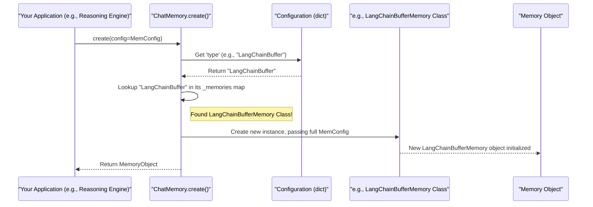

# Chapter 6: ChatMemoryFactory

Welcome to Chapter 6! In [Chapter 5: PromptManagement](05_promptmanagement_.md), we learned how to give clear and effective instructions (prompts) to our AI using `PromptRender` and `MessageManager`. These tools help us talk *to* the AI. But what about the AI remembering what *we've* talked about?

Imagine you're chatting with a friend. If they forgot everything you said just a minute ago, the conversation wouldn't flow very well, right? You'd have to repeat yourself constantly. AI models, especially chat-based ones, can be like that friend with a very short memory unless we help them remember!

This is where **`ChatMemoryFactory`** comes in. It's all about giving our AI a good memory.

## Why Does an AI Need a Memory?

Let's say you're building an AI assistant to help you plan a trip:
*   **You:** "Hi! I want to plan a trip to Paris."
*   **AI:** "Great! Paris is wonderful. When are you thinking of going?"
*   **You:** "Next month, for about a week."
*   **AI:** "Okay, a week in Paris next month. Are you interested in museums, food, or something else?"
*   **You:** "Mostly museums and some good local food."

For the AI to have this natural conversation, it needs to *remember*:
1.  The destination is Paris.
2.  The trip is next month.
3.  The duration is about a week.
4.  You're interested in museums and food.

Without memory, each time you send a message, the AI would treat it as a brand new conversation, making it impossible to have a meaningful dialogue.

**`ChatMemoryFactory`** is the system in our `src` project that helps us choose and create the right *type* of memory for our AI, depending on what we need.

## Different "Notebooks" for Different Memory Needs

Think of conversation memory like different kinds of notebooks you might use:

*   **A Simple Scratchpad (`BufferMemory`)**: This notebook keeps *everything* said in the conversation so far. Good for short chats, but can get very long!
*   **A "Last Few Pages" Notebook (`BufferWindowMemory`)**: This one only remembers the most recent parts of the conversation (e.g., the last 5 exchanges). Useful for keeping memory manageable.
*   **A Summarized Digest (`SummaryMemory`)**: For very long conversations, this notebook doesn't keep every word. Instead, it periodically creates a summary of what's been discussed and remembers that. This needs another AI (an LLM) to do the summarizing!
*   **A Searchable Database (e.g., `ChromaStoreMemory`, `LangChainRemoteMemory`)**: Imagine a notebook where you can quickly search for specific facts or past topics. `ChromaStoreMemory` uses a special kind of database (a vector store) to remember and retrieve relevant information, often used in more advanced setups like RAG (Retrieval Augmented Generation). `LangChainRemoteMemory` could connect to an external service that stores and manages conversation history.

The `ChatMemoryFactory` (which is actually our `ChatMemory` class and its `create` method) is like a helpful librarian. You tell the librarian what kind of "notebook" you need, and they fetch it for you.

## How to Get a "Memory Notebook" using `ChatMemoryFactory`

Let's say we want a simple "scratchpad" memory for our AI – one that remembers the whole conversation. This is often called `BufferMemory`.

**1. Prepare the Configuration:**
First, we need to tell the "librarian" (`ChatMemory.create()`) what we want. We do this with a Python dictionary. This configuration would typically come from our main settings managed by [PlatformConfiguration](01_platformconfiguration_.md).

```python
# Configuration for a simple LangChain Buffer Memory
buffer_memory_config = {
    "type": "LangChainBuffer",      # The type of "notebook" we want
    "memory_key": "chat_history"    # A name to identify this memory's content
}
```
*   `"type": "LangChainBuffer"`: This tells the factory to give us a LangChain-style buffer memory.
*   `"memory_key": "chat_history"`: This is like a label for the section in the AI's "brain" where this conversation history will be stored. It's often used by the [ReasoningEngineFactory](03_reasoningenginefactory_.md) to access the conversation history.

**2. Ask the Factory to Create the Memory:**
Now, we use the `ChatMemory.create()` method from `lib/services/chat/memory.py`:

```python
from src.lib.services.chat.memory import ChatMemory

# Assume buffer_memory_config is defined as above

try:
    # The factory creates the specific memory instance
    my_chat_memory = ChatMemory.create(config=buffer_memory_config)
    print("Successfully created a LangChainBuffer memory instance!")
    
    # Now, my_chat_memory is ready!
    # A Reasoning Engine would use this object to store and retrieve
    # conversation messages.
    
except ValueError as e:
    print(f"Error creating chat memory: {e}")
```

**3. What You Get:**
If successful, `my_chat_memory` will hold an object that represents our "scratchpad" notebook. This object will have methods to:
*   Save new messages (e.g., when the user or AI says something).
*   Load the past conversation when the AI needs to remember the context.

This memory object is then typically passed to a "reasoning engine" (created by [ReasoningEngineFactory](03_reasoningenginefactory_.md)) so the AI can use it.

## Under the Hood: How the "Librarian" Finds Your Notebook

When you call `ChatMemory.create(config)`:

1.  **Request Received**: Your application (or another part of `src`, like a Reasoning Engine during its setup) calls `ChatMemory.create()` with your configuration dictionary.
2.  **Check the "Type"**: The `create()` method looks at the `"type"` key in your `config` (e.g., `"LangChainBuffer"`).
3.  **Consult the Catalog**: `ChatMemory` has an internal "catalog" – a Python dictionary named `_memories`. This catalog maps type names (like `"LangChainBuffer"`) to the actual Python classes that know how to implement that specific type of memory (e.g., `LangChainBufferMemory` class).
4.  **Create the "Notebook"**: If it finds a matching class in its catalog, it creates a new instance (an object) of that class. Crucially, it passes the *entire* `config` dictionary to the constructor of that specific memory class.
5.  **Hand Over the "Notebook"**: The newly created, configured memory object is returned.

Here's a simplified diagram of this flow:



### Code Dive: The `ChatMemory` Factory Class

Let's look at the `ChatMemory` class (from `lib/services/chat/memory.py`). This is our "librarian" or factory.

```python
# Simplified from lib/services/chat/memory.py
from typing import Type, Dict, Any
# Import the actual classes for specific memory types
from src.lib.services.chat.memories.langchain.buffer import (
    LangChainBufferMemory)
# ... other memory imports like LangChainBufferWindowMemory, LangChainSummaryMemory, etc.

class ChatMemory:
    # The "_memories" catalog: maps type string to actual Python class
    _memories: Dict[str, Type] = {
        'LangChainBuffer': LangChainBufferMemory,
        # 'LangChainBufferWindow': LangChainBufferWindowMemory,
        # 'LangChainSummary': LangChainSummaryMemory,
        # ... other supported memory types would be listed here
    }

    @staticmethod # Call it on the class: ChatMemory.create()
    def create(config: Dict[str, Any]) -> object: # Returns an instance of some memory
        memory_type = config.get('type')
        if not memory_type:
            raise ValueError("Configuration must include 'type' for ChatMemory.")

        memory_class = ChatMemory._memories.get(memory_type)
        if not memory_class:
            raise ValueError(f"Unsupported memory type: {memory_type}")

        # Create an instance of the found class, passing the config to it.
        return memory_class(config)
```
*   `_memories`: This dictionary is the "catalog." It maps a string like `'LangChainBuffer'` to the Python class `LangChainBufferMemory` that handles that type of memory.
*   `create(config)`: This static method does the main job.
    1.  It gets the `type` from the `config`.
    2.  It looks up the corresponding class in `_memories`.
    3.  It then creates an instance of that class by calling `memory_class(config)`, passing the configuration dictionary directly to the specific memory's constructor.

This factory pattern is very similar to what we saw in [ReasoningEngineFactory](03_reasoningenginefactory_.md) and [ChatModelFactory](04_chatmodelfactory_.md)!

### The Blueprint: `BaseChatMemory`

All specific memory classes (like `LangChainBufferMemory`) are built from a common blueprint. This is an "abstract base class" called `BaseChatMemory` (from `lib/services/chat/memories/base.py`). It ensures all our "notebooks" have a consistent way to be configured and used.

```python
# Simplified from lib/services/chat/memories/base.py
import abc # Stands for Abstract Base Class
from pydantic import BaseModel, Field
from typing import Optional, Any

class BaseChatMemory(abc.ABC):
    # Inner class for standard configuration structure
    class Config(BaseModel):
        type: str = Field(..., description="Type of the memory.")
        memory_key: str = Field(..., description="Key for this memory.")
        # ... other common fields could be added ...

    # Inner class for standard result structure
    class Result(BaseModel):
        status: str = "success"
        error_message: Optional[str] = None
        memory: Optional[Any] = None # To return the actual memory object
        # ... other fields like 'context' could be added ...
        
    @abc.abstractmethod # Specific memories MUST implement this
    def get_memory(self) -> 'BaseChatMemory.Result':
        """Return the actual memory instance (e.g., the LangChain memory object)."""
        pass

    @abc.abstractmethod
    def clear(self) -> 'BaseChatMemory.Result':
        """Clear the memory's content."""
        pass
```
*   **`Config` (Pydantic Model)**: Defines common settings all memory types expect (like `type` and `memory_key`). Specific memory classes use this to parse their part of the configuration.
*   **`Result` (Pydantic Model)**: A standard way for memory operations to report their outcome.
*   **`get_memory()`**: An abstract method. Each specific memory type must provide its own way to return the underlying memory object (e.g., the actual LangChain memory object).
*   **`clear()`**: An abstract method. Each memory type must know how to clear its stored conversation.

### A Specific "Notebook": `LangChainBufferMemory`

When `ChatMemory.create()` calls, for example, `LangChainBufferMemory(config)`, the `__init__` method of `LangChainBufferMemory` (from `lib/services/chat/memories/langchain/buffer.py`) is run:

```python
# Simplified from lib/services/chat/memories/langchain/buffer.py
from langchain.memory import ConversationBufferMemory # The actual LangChain class
from src.lib.core.log import Logger # From Chapter 1
from src.lib.services.chat.memories.base import BaseChatMemory # Our blueprint
from typing import Dict, Any, Optional

logger = Logger().get_logger() # Get the central logger

class LangChainBufferMemory(BaseChatMemory): # Implements the blueprint
    # Can extend the base Config if needed
    class Config(BaseChatMemory.Config):
        return_messages: Optional[bool] = True # LangChain specific option

    def __init__(self, config_dict: Dict[str, Any]):
        # Validate and store configuration using its Pydantic Config model
        self.config = LangChainBufferMemory.Config(**config_dict)
        self.result = LangChainBufferMemory.Result() # Prepare result object
        
        # Initialize the actual LangChain ConversationBufferMemory
        self.memory_instance = ConversationBufferMemory(
            memory_key=self.config.memory_key,
            return_messages=self.config.return_messages
        )
        logger.info(f"LangChainBufferMemory for key '{self.config.memory_key}' initialized.")

    def get_memory(self) -> 'BaseChatMemory.Result':
        # self.result.memory = self.memory_instance
        # self.result.status = "success"
        # return self.result
        pass # Actual implementation would return self.memory_instance in self.result

    def clear(self) -> 'BaseChatMemory.Result':
        # self.memory_instance.clear()
        # self.result.status = "success"
        # return self.result
        pass # Actual implementation would call clear on self.memory_instance
```
*   The `__init__` receives the `config_dict` from the factory.
*   It uses its own Pydantic `Config` model to parse and validate these settings.
*   It then creates an instance of LangChain's `ConversationBufferMemory`, configuring it with settings like `memory_key`.
*   The `logger` (from [Chapter 1: PlatformConfiguration](01_platformconfiguration_.md)) is used to record that the memory has been set up.
*   The `get_memory()` method would return this `self.memory_instance` packaged in a `Result` object. The `clear()` method would call `self.memory_instance.clear()`.

## More "Notebooks" from the Factory

Our `ChatMemoryFactory` can create various types of memory. Here are a few examples and their key configuration parameters:

1.  **`LangChainBufferWindowMemory` (Last Few Pages):**
    Keeps only the last `k` interactions.
    ```python
    window_memory_config = {
        "type": "LangChainBufferWindow",
        "memory_key": "chat_history",
        "window": 5  #  <-- Remembers the last 5 back-and-forths
    }
    # my_window_memory = ChatMemory.create(config=window_memory_config)
    ```
    This uses `ConversationBufferWindowMemory` from LangChain. The `window` parameter (named `k` in LangChain) is key here.

2.  **`LangChainSummaryMemory` (Summarized Digest):**
    Periodically summarizes the conversation. This requires an LLM to do the summarizing.
    ```python
    summary_memory_config = {
        "type": "LangChainSummary",
        "memory_key": "chat_summary",
        "llm_model": {  # <-- Config for the LLM that does summarizing
            "type": "LangChainChatOpenAI", # Example, from ChatModelFactory
            "api_key": "$ENV{OPENAI_API_KEY}",
            "model_name": "gpt-3.5-turbo"
        }
    }
    # my_summary_memory = ChatMemory.create(config=summary_memory_config)
    ```
    This memory type needs an LLM model, configured just like we learned in [Chapter 4: ChatModelFactory](04_chatmodelfactory_.md). It uses `ConversationSummaryMemory` from LangChain.

3.  **`LangChainChromaStoreMemory` (Searchable Database):**
    Stores conversation turns in a Chroma vector database, allowing semantic search over the history.
    ```python
    chroma_memory_config = {
        "type": "LangChainChromaStore",
        "memory_key": "vector_chat_history",
        "persist_directory": "./my_chroma_db", # <-- Where to save the DB
        "collection_name": "trip_planner_conversations", # DB collection
        "k": 3 # How many relevant past interactions to retrieve
    }
    # my_chroma_memory = ChatMemory.create(config=chroma_memory_config)
    ```
    This is more advanced and uses LangChain's `VectorStoreRetrieverMemory` with a Chroma vector store. It needs a place to store its database (`persist_directory`) and a `collection_name`.

4.  **`LangChainRemoteMemory` (Memory in the Cloud):**
    Connects to an external web service to load and save conversation history.
    ```python
    remote_memory_config = {
        "type": "LangChainRemote",
        "memory_key": "remote_chat_history",
        "base_url": "http://my-memory-service.com/api/memory" # <-- URL of remote service
    }
    # my_remote_memory = ChatMemory.create(config=remote_memory_config)
    ```
    The `base_url` points to an external API that handles storing and retrieving messages. Our `LangChainRemoteMemory` class in `lib/services/chat/memories/langchain/custom_remote.py` defines how to talk to such a service.

By changing the `type` and providing the necessary parameters in the configuration, you can easily switch between different memory strategies for your AI agent!

## Conclusion

The `ChatMemoryFactory` (implemented as `ChatMemory.create()`) is a vital component for building AI agents that can hold coherent, context-aware conversations. It acts as a central point for creating different types of "memory notebooks," allowing you to choose the best way for your AI to remember past interactions.

You've learned:
*   Why conversation memory is essential.
*   The different types of memory strategies, from simple buffers to summaries and vector stores.
*   How to configure and request a specific memory type using `ChatMemory.create()`.
*   The internal workings: a catalog (`_memories`) mapping types to specific memory classes, all built on a `BaseChatMemory` blueprint.

With memory in place, our AI can remember what's been said. But what if the AI needs to *do* something beyond just talking? What if it needs to search the web, run some code, or use another specialized tool? That's where tool management comes in. Let's explore that in the next chapter: [Chapter 7: ToolManagement](07_toolmanagement_.md).

---

Generated by [AI Codebase Knowledge Builder](https://github.com/The-Pocket/Tutorial-Codebase-Knowledge)