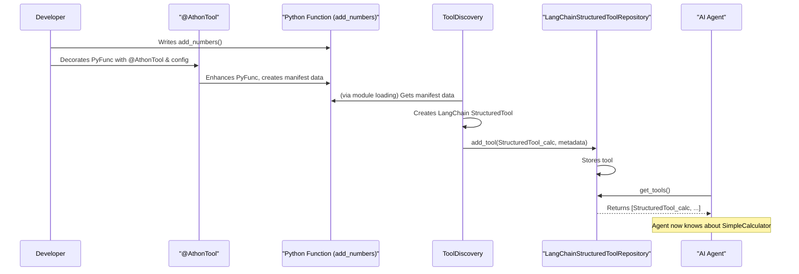

# Chapter 7: ToolManagement

Welcome to Chapter 7! In the [previous Chapter 6: ChatMemoryFactory](06_chatmemoryfactory_.md), we explored how our AI can remember past conversations, making interactions more natural and context-aware. But what if our AI needs to do more than just chat and remember? What if it needs to perform actions, like looking up today's weather, searching the web for specific information, or even making a calculation?

This is where **ToolManagement** comes in! It’s all about giving your AI special abilities or "tools" to interact with the world beyond simple conversation.

## What's the Big Idea with Tools?

Imagine you have a very smart assistant. You can ask it questions, and it remembers what you've talked about. But if you ask, "What's the weather like in London right now?", the assistant can't just *know* the answer from its internal knowledge. It needs a way to *find out* – it needs a weather tool!

**ToolManagement** is the system that handles:
1.  **Defining Tools**: How we specify what a tool does and how to use it.
2.  **Finding Tools**: How the system discovers these tools, whether they are built-in or come from external services.
3.  **Making Tools Available**: How these tools are organized and given to an AI agent so it can use them.

Let's break down the key parts of ToolManagement in our `src` project:

*   **`AthonTool`**: Think of this as a **blueprint** for creating a standardized tool. It's a way to wrap a normal Python function (or an external capability) and give it a clear description, name, and instructions on what inputs it needs. This makes it understandable and usable by an AI.
*   **`ToolDiscovery`**: This is like a **scout** or a detective. Its job is to go out and find all the available tools. It might look for tools defined locally in our project using `AthonTool`, or it might find tools offered by other services.
*   **`ToolRepository`**: This is the **workshop** or the central **toolbox**. Once `ToolDiscovery` finds the tools, they are organized and stored in a `ToolRepository`. From here, an AI agent can "pick up" a tool it needs to accomplish a task.

**Use Case: A Simple Calculator AI**

Let's say we want our AI to be able to add two numbers.
1.  We define an "add_numbers" function in Python.
2.  We use `AthonTool` to wrap this function, giving it a name like "calculator" and a description like "Use this tool to add two numbers. Input should be two numbers."
3.  `ToolDiscovery` finds this "calculator" tool.
4.  The "calculator" tool is added to a `ToolRepository`.
5.  When a user asks the AI, "What is 5 plus 7?", the AI (specifically, its "brain" from [Chapter 3: ReasoningEngineFactory](03_reasoningenginefactory_.md)) realizes it needs to calculate. It looks in the `ToolRepository`, finds the "calculator" tool, and uses it with inputs 5 and 7. The tool runs, returns 12, and the AI can then tell the user the answer.

## `AthonTool`: The Blueprint for Tools

`AthonTool` (from `lib/system_services/tool_client.py`) is primarily a Python decorator. A decorator is a special way to modify or enhance a function. When you use `@AthonTool`, you're essentially packaging your function into a standardized "tool" format.

**1. Define a Simple Python Function:**
Let's create our `add_numbers` function:
```python
# In a Python file, e.g., my_calculator_tool.py
def add_numbers(a: int, b: int) -> str:
    """Adds two numbers and returns the sum as a string."""
    result = a + b
    return f"The sum of {a} and {b} is {result}."
```
This is a normal Python function.

**2. Turn it into an `AthonTool`:**
Now, we use the `@AthonTool` decorator. `AthonTool` needs a configuration that describes the tool. This configuration is often in a YAML file.

Let's imagine a `calculator_config.yaml` for our tool:
```yaml
# calculator_config.yaml
tool:
  name: "SimpleCalculator"
  function: "add_numbers_tool" # A name for the decorated function
  description: "Use this tool to add two numbers. Provide the two numbers to add."
  arguments:
    - name: "a"
      type: "int"
      description: "The first number."
    - name: "b"
      type: "int"
      description: "The second number."
  return_direct: True # Often true for AI tools
# logger and webapp configs can also be here
```

And in our Python file:
```python
# my_calculator_tool.py
from src.lib.system_services.tool_client import AthonTool

# The config tells AthonTool about the function it's decorating
# AthonTool can load this from the YAML path.
@AthonTool(config="calculator_config.yaml")
def add_numbers_tool(a: int, b: int) -> str: # Note: function name can match config or be different
    """Adds two numbers and returns the sum as a string."""
    result = a + b
    return f"The sum of {a} and {b} is {result}."

# Now, add_numbers_tool is not just a function, it's an AthonTool!
# It has a manifest accessible via add_numbers_tool.get_manifest()
```
*   `@AthonTool(config="calculator_config.yaml")`: This line applies the decorator. `AthonTool` reads `calculator_config.yaml`.
*   The YAML defines the tool's `name` (for the AI to refer to), `description` (so the AI knows when to use it), and `arguments` (so the AI knows what inputs to provide).
*   Our `add_numbers_tool` function is now enhanced. `AthonTool` has generated a "manifest" for it, which is a structured description based on the YAML and the function itself.

The manifest might look something like this (conceptually):
```
{
  "name": "SimpleCalculator",
  "function_name_in_code": "add_numbers_tool",
  "description": "Use this tool to add two numbers. Provide the two numbers to add.",
  "arguments": [
    {"name": "a", "type": "int", "description": "The first number."},
    {"name": "b", "type": "int", "description": "The second number."}
  ],
  "return_direct": True
}
```
This manifest is crucial because it's what an AI uses to understand how to use the tool.

## `ToolDiscovery`: The Scout for Tools

`ToolDiscovery` (from `lib/system_services/tool_server.py`) is responsible for finding these tools.

It can:
*   **Load local tools**: If you tell it the path to a directory containing `AthonTool`-decorated functions (like our `my_calculator_tool.py`), it can load them.
*   **Load remote tools**: If a tool is hosted as a web service and exposes its manifest at a URL, `ToolDiscovery` can fetch that manifest and create a way to call that remote tool.

When `ToolDiscovery` finds a tool (either local or remote), it typically converts it into a format that AI frameworks like LangChain can easily use. For example, it might turn our `SimpleCalculator` into a LangChain `StructuredTool`.

```python
# How ToolDiscovery might be used (simplified)
from src.lib.system_services.tool_server import ToolDiscovery

tool_discoverer = ToolDiscovery()

# Discover our local calculator tool
# (Assuming my_calculator_tool.py is in a 'tools/calculator' directory)
tool_info = tool_discoverer.discover_tool(tool_reference="tools/calculator")

if tool_info and "tool" in tool_info:
    discovered_calculator_tool = tool_info["tool"]
    # discovered_calculator_tool is now likely a LangChain StructuredTool
    print(f"Discovered tool: {discovered_calculator_tool.name}")
    print(f"Description: {discovered_calculator_tool.description}")
```
**Expected Output:**
```
Discovered tool: SimpleCalculator
Description: Use this tool to add two numbers. Provide the two numbers to add.
```
`ToolDiscovery` reads the manifest provided by `AthonTool` (or a remote service) and uses it to create a standardized tool object.

## `ToolRepository`: The Central Toolbox

Once tools are discovered and standardized, they need a place to be stored and accessed. This is the job of the `ToolRepository`.

Our `src` project uses a factory pattern for repositories, similar to how we saw [ChatModelFactory](04_chatmodelfactory_.md) and [ChatMemoryFactory](06_chatmemoryfactory_.md) work. The main factory class is `ToolRepository` (from `lib/services/agents/tool_repository.py`).

**1. Configure the Repository Type:**
We usually want a repository that works well with LangChain.
```python
repo_config = {
    "type": "LangChainStructured" # We want a LangChain-compatible toolbox
}
```

**2. Create the Repository Instance:**
```python
from src.lib.services.agents.tool_repository import ToolRepository

# The factory creates the specific repository
try:
    my_toolbox = ToolRepository.create(config=repo_config)
    print("Toolbox (LangChainStructuredToolRepository) created!")
except ValueError as e:
    print(f"Error creating toolbox: {e}")

# my_toolbox is now an instance of LangChainStructuredToolRepository
```
The `LangChainStructuredToolRepository` (from `lib/services/agents/tool_repositories/langchain/structured_tool.py`) is a **singleton**. This means there's only one instance of this specific toolbox throughout the application, ensuring all parts of the system share the same set of registered tools.

**3. Add Discovered Tools to the Repository:**
Now we can add the `discovered_calculator_tool` (which we got from `ToolDiscovery`) to our `my_toolbox`.
```python
# Assuming 'my_toolbox' and 'discovered_calculator_tool' exist
# We can also add some metadata about where this tool came from.
tool_metadata = {"source": "local_calculator_module"}

add_result = my_toolbox.add_tool(
    tool=discovered_calculator_tool,
    metadata=tool_metadata
)

if add_result.status == "success":
    print(f"Tool '{discovered_calculator_tool.name}' added to the toolbox.")
```
Now, our `SimpleCalculator` tool is in the `my_toolbox`, ready to be used by an AI agent.

An AI agent (like those created by [ReasoningEngineFactory](03_reasoningenginefactory_.md)) would be given access to this `my_toolbox` (or the list of tools from it). When the agent needs to perform a calculation, it will find and use the `SimpleCalculator`.

## Under the Hood: How It All Connects

Let's trace the journey of a tool from definition to being ready for an AI agent.

1.  **Developer Defines**: A developer writes a Python function and uses `@AthonTool` with a configuration YAML. This packages the function as a tool with a manifest.
2.  **Discovery Phase**: `ToolDiscovery.discover_tool("path/to/tool_module")` is called.
    *   `ToolDiscovery` loads the Python module.
    *   It accesses the manifest generated by `AthonTool` (e.g., `tool_module.main(True)` as in `_load_local_tool`).
    *   It uses this manifest (name, description, arguments) to create a LangChain `StructuredTool`.
3.  **Repository Setup**: `ToolRepository.create({"type": "LangChainStructured"})` creates (or returns the existing instance of) `LangChainStructuredToolRepository`.
4.  **Registration**: The `LangChainStructuredToolRepository.add_tool()` method is called with the `StructuredTool` from step 2. The tool (and any metadata) is stored internally in a list within the repository.
5.  **Agent Usage**: A [ReasoningEngineFactory](03_reasoningenginefactory_.md) component, when creating an agent, will get the list of tools from this repository (e.g., by calling `my_toolbox.get_tools()`). The agent is then initialized with these tools.

Here's a simplified sequence diagram:



### Key Code Components:

*   **`AthonTool` (`lib/system_services/tool_client.py`)**:
    *   The `__init__` method loads and validates the tool's configuration (often from a YAML file), including its manifest details (name, description, arguments).
    *   The `__call__` method makes it a decorator. When applied to a function, it stores the function and makes a `get_manifest()` method available on the decorated function.
    ```python
    # Simplified from lib/system_services/tool_client.py
    class AthonTool:
        def __init__(self, config: Union[dict, str, None] = None, ...):
            self.config = self._init_config(config) # Loads YAML, validates manifest
            # ...
        def __call__(self, func: Any) -> Any:
            self.function = func # Stores the original function
            # ... (wrapper setup) ...
            wrapper.get_manifest = self.get_manifest # Make manifest accessible
            return wrapper
        
        def get_manifest(self, json_flag: bool = False) -> dict:
            manifest = copy.deepcopy(self.config["tool"])
            if not json_flag: # If for programmatic use, link to actual function
                manifest["function"] = self.function 
            return manifest
    ```

*   **`ToolDiscovery` (`lib/system_services/tool_server.py`)**:
    *   `discover_tool()`: If the `tool_reference` is a local path, it calls `_load_local_tool()`.
    *   `_load_local_tool()`: Imports the Python module for the tool. It expects the module to have a way to return its manifest (e.g., a `main(True)` function that returns the manifest from the `AthonTool` instance).
    *   `_create_tool_from_local_manifest()`: Takes this manifest and creates a `StructuredTool` using `StructuredTool.from_function()`.
    ```python
    # Simplified from lib/system_services/tool_server.py
    class ToolDiscovery:
        def discover_tool(self, tool_reference: str) -> Dict[str, Any]:
            if tool_reference.startswith("http"):
                # ... load remote tool manifest via HTTP ...
                pass
            else: # Local tool
                tool_obj, _ = self._load_local_tool(tool_reference)
            # ... (return tool_info with "tool": tool_obj) ...

        def _load_local_tool(self, tool_path: str):
            # ... import the module from tool_path/main.py ...
            # tool_module = importlib.util.module_from_spec(spec)
            # spec.loader.exec_module(tool_module)
            # manifest = tool_module.main(True) # Assumes main.py has AthonTool setup
            # tool_object = self._create_tool_from_local_manifest(manifest)
            # return tool_object, manifest.get("interface")
            pass # Simplified

        def _create_tool_from_local_manifest(self, manifest: Dict[str, Any]):
            # args_schema = self._create_args_schema(manifest['name'], manifest['arguments'])
            # tool = StructuredTool.from_function(
            #     name=manifest['name'],
            #     args_schema=args_schema,
            #     func=manifest['function'], # Actual Python function from manifest
            #     description=manifest['description']
            # )
            # return tool
            pass # Simplified
    ```

*   **`ToolRepository` Factory (`lib/services/agents/tool_repository.py`)**:
    This follows the familiar factory pattern.
    ```python
    # Simplified from lib/services/agents/tool_repository.py
    class ToolRepository:
        _repositories: Dict[str, Type] = {
            'LangChainStructured': LangChainStructuredToolRepository,
            # Other repository types could be added
        }

        @staticmethod
        def create(config: Dict[str, Any]) -> object:
            repo_type = config.get('type')
            # ... (error handling) ...
            repo_class = ToolRepository._repositories.get(repo_type)
            # ... (error handling) ...
            return repo_class(config) # Instantiates the specific repository
    ```

*   **`BaseToolRepository` (`lib/services/agents/tool_repositories/base.py`)**:
    This abstract class defines the common interface for all tool repositories.
    ```python
    # Simplified from lib/services/agents/tool_repositories/base.py
    class BaseToolRepository(abc.ABC):
        # ... (Config and Result Pydantic models) ...
        @abc.abstractmethod
        def add_tool(self, tool: Any, metadata: Optional[Dict[str, Any]] = None) -> 'BaseToolRepository.Result':
            pass
        @abc.abstractmethod
        def get_tools(self, metadata_filter: Optional[Dict[str, Any]] = None) -> 'BaseToolRepository.Result':
            pass
    ```

*   **`LangChainStructuredToolRepository` (`lib/services/agents/tool_repositories/langchain/structured_tool.py`)**:
    This is the concrete implementation for storing LangChain `StructuredTool` objects. It's a singleton.
    ```python
    # Simplified from lib/services/agents/tool_repositories/langchain/structured_tool.py
    class LangChainStructuredToolRepository(BaseToolRepository):
        _instance = None # For singleton
        _lock = threading.Lock() # For thread-safe singleton creation

        def __new__(cls, *args, **kwargs): # Singleton creation
            with cls._lock:
                if cls._instance is None:
                    cls._instance = super().__new__(cls)
            return cls._instance

        def __init__(self, config: Dict[str, Any] = None):
            if not hasattr(self, '_initialized'): # Initialize only once
                self._tools = [] # Stores the actual tool objects
                self._metadata = {} # Stores metadata for each tool by tool.name
                self._initialized = True
        
        def add_tool(self, tool: Any, metadata: Optional[Dict[str, Any]] = None):
            self._tools.append(tool)
            if metadata:
                self._metadata[tool.name] = metadata
            # ... (return Result object) ...
        
        def get_tools(self, metadata_filter: Optional[Dict[str, Any]] = None):
            # ... (filters self._tools based on metadata_filter and returns them) ...
            # Returns a list of dicts: {"object": tool, "metadata": tool_metadata}
            pass
    ```

### Advanced: Tools from External Systems (MCP)

Our `src` platform can also discover tools from more complex external systems using the Multi-Component Protocol (MCP). The `MCPToLangChainAdapter` (from `lib/services/mcp/adapters/langchain_tools.py`) is a specialized tool discoverer.
1.  It uses an `MCPRegistry` to find out about available "MCP servers" (other services that speak this protocol).
2.  It queries these servers for the tools they offer (`discover_all_capabilities`).
3.  For each tool specification received from an MCP server, it converts it into a LangChain `StructuredTool` (`_convert_mcp_tool_to_langchain`). This involves creating a function that knows how to call the remote MCP tool.
4.  These converted LangChain tools are then added to our `LangChainStructuredToolRepository` just like locally discovered tools.

This allows the AI agent to use tools provided by other microservices or external systems without needing to know the low-level details of the MCP. The adapter handles the translation.

## Conclusion

**ToolManagement** is what empowers your AI agent to go beyond just talking and actually *do* things. You've learned about:
*   **`AthonTool`**: The blueprint used to define a function as a standardized tool with a clear description (manifest) of what it does and how to use it.
*   **`ToolDiscovery`**: The scout that finds these tools, whether they are local Python functions decorated with `AthonTool` or capabilities offered by external services (like through MCP). It converts them into a standard format usable by AI agents.
*   **`ToolRepository`**: The central workshop or toolbox (like `LangChainStructuredToolRepository`) where all discovered and standardized tools are stored, ready for an AI agent to pick up and use.

By defining tools, making them discoverable, and organizing them in a repository, we provide our AI agents (from [Chapter 3: ReasoningEngineFactory](03_reasoningenginefactory_.md)) with the special abilities they need to handle a wider range of tasks and interact more effectively with the world.

Now that our AI can chat, remember, and use tools, what if it needs to access and reason over large amounts of custom documents or data? This is where Retrieval Augmented Generation (RAG) comes in. Let's explore the building blocks for RAG in the next chapter: [Chapter 8: RAGPipelineComponents](08_ragpipelinecomponents_.md).

---

Generated by [AI Codebase Knowledge Builder](https://github.com/The-Pocket/Tutorial-Codebase-Knowledge)