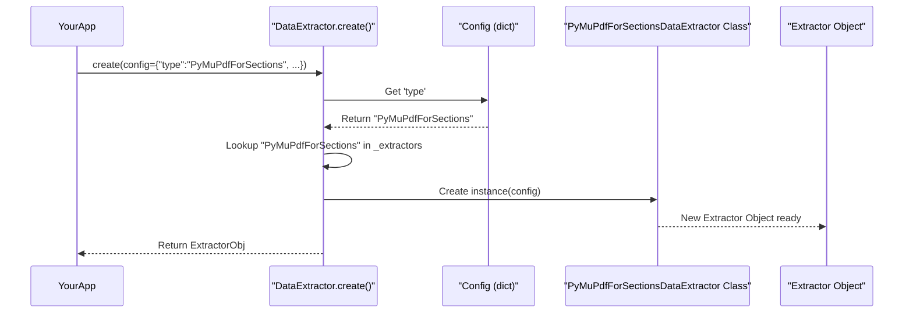
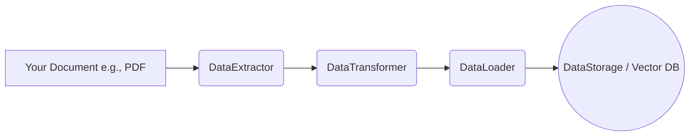
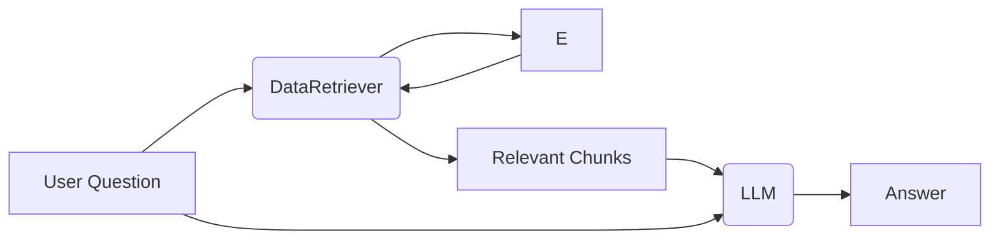

# Chapter 8: RAGPipelineComponents

Welcome to Chapter 8! In [Chapter 7: ToolManagement](07_toolmanagement_.md), we learned how to give our AI special "tools" to perform actions like calculations or web searches. This greatly expands what our AI can *do*. But what if we want our AI to *know* about specific information that isn't part of its general training, like your company's private documents or the latest news articles?

Large Language Models (LLMs) are trained on vast amounts of data, but that data has a cut-off point, and they don't have access to your private, real-time, or domain-specific information. This is where **Retrieval Augmented Generation (RAG)** comes in!

## What's the Big Idea with RAGPipelineComponents?

Imagine you want to build an AI assistant that can answer questions about your company's latest product manuals. These manuals are not on the public internet, so your general-purpose LLM (from [ChatModelFactory](04_chatmodelfactory_.md)) won't know their content.

**RAGPipelineComponents** are a collection of specialized modules that work together like a research assistant team to solve this problem. They allow an LLM to "read" and use external documents to answer questions. Here's our team:

1.  **`DataExtractor` (The Librarian's Apprentice)**: This team member is responsible for pulling out the raw information (text) from various document types (like PDFs, text files, Word documents, etc.).
2.  **`DataTransformer` (The Editor)**: Once the raw information is extracted, the Editor steps in. They clean up the text, structure it, and often break it down into smaller, more manageable chunks or pieces. This is important for the next steps.
3.  **`DataStorage` (The Chief Librarian)**: This is where the organized and processed information lives. Think of it as a special, well-organized library. Technically, this is often a "vector database" (like Chroma, Qdrant, or Milvus) that stores information in a way that makes it easy to find relevant pieces later.
4.  **`DataLoader` (The Library Clerk)**: After the Editor has prepared the information, the Library Clerk takes these polished pieces and carefully files them away into the library (the `DataStorage`).
5.  **`DataRetriever` (The Speedy Researcher)**: When the LLM gets a question (e.g., "How do I install Feature X from the manual?"), the Speedy Researcher quickly dashes into the library (`DataStorage`) and finds the most relevant documents or chunks of text that can help answer that question.

These retrieved documents are then given to the LLM along with the original question, allowing it to generate an informed answer based on this new, specific knowledge.

Let's see how you can use these components!

## Using the RAG Team: A Step-by-Step Example

Let's say we have a PDF manual named `product_manual.pdf` and we want our AI to answer questions about it.

### Step 1: Extracting Information with `DataExtractor`

First, we need the "Librarian's Apprentice" (`DataExtractor`) to get the text out of our PDF.

**1. Configuration:**
We need to tell the `DataExtractor` what kind of document it's dealing with.
```python
# Configuration for extracting from a PDF
pdf_extractor_config = {
    "type": "PyMuPdfForSections" # Tells the factory to use a PDF extractor
    # Other specific settings for PyMuPdf might go here
}
```
The `"type"` key tells our factory which specific extractor tool to use. `PyMuPdfForSectionsDataExtractor` is good for PDFs.

**2. Create and Use the Extractor:**
```python
from src.lib.services.rag.data_extractor import DataExtractor

# Create the extractor
extractor = DataExtractor.create(config=pdf_extractor_config)

# Extract data from our PDF
# Assume 'document_path' is "product_manual.pdf"
extraction_result = extractor.extract(document_path="product_manual.pdf")

if extraction_result.status == "success":
    raw_text_chunks = extraction_result.content
    print(f"Extracted {len(raw_text_chunks)} chunks from the PDF.")
    # raw_text_chunks would be a list of text sections
```
After this, `raw_text_chunks` will contain the text extracted from `product_manual.pdf`, possibly already broken down into sections or pages by the extractor.

### Step 2: Cleaning and Structuring with `DataTransformer`

Next, the "Editor" (`DataTransformer`) takes these raw text chunks and processes them further. A common task is to split long text into smaller, consistent pieces, which is better for storage and retrieval.

**1. Configuration:**
```python
# Configuration for a simple text transformer (e.g., splitting text)
transformer_config = {
    "type": "CteActionRunner", # A general purpose transformer
    "actions": [ # Simplified: Imagine actions for text splitting
        {"name": "split_text", "chunk_size": 500, "chunk_overlap": 50}
    ]
}
```
`"type": "CteActionRunner"` allows defining a sequence of transformation actions. Here, we're imagining a text-splitting action.

**2. Create and Use the Transformer:**
```python
from src.lib.services.rag.data_transformer import DataTransformer

transformer = DataTransformer.create(config=transformer_config)

# Transform the raw text chunks
# Assume 'raw_text_chunks' is from the previous step
transformed_docs = []
for chunk in raw_text_chunks: # Or pass all chunks if transformer supports it
    transform_result = transformer.transform(content=chunk) # Simplified
    if transform_result.status == "success":
        transformed_docs.extend(transform_result.content) # Add processed chunks

print(f"Transformed into {len(transformed_docs)} smaller documents.")
# transformed_docs now contains smaller, cleaned-up text pieces.
```
The `transformed_docs` are now ready to be put into our special library.

### Step 3: Setting Up the Library with `DataStorage`

The "Chief Librarian" (`DataStorage`) helps us set up and manage our specialized library (vector database). We'll use ChromaDB for this example.

**1. Configuration:**
```python
# Configuration for ChromaDB storage
storage_config = {
    "type": "ChromaCollection",
    "collection_name": "product_manuals_db",
    "persist_directory": "./my_manual_vector_db" # Where to save the DB
    # Embedding function config might also go here if not default
}
```
This tells the factory to set up a ChromaDB collection named `product_manuals_db` and save it to the `./my_manual_vector_db` folder.

**2. Create and Use the Storage (Optional Initialization):**
```python
from src.lib.services.rag.data_storage import DataStorage

storage = DataStorage.create(config=storage_config)

# Often, creating the storage instance is enough to initialize it.
# Some methods might exist to explicitly create/check the collection.
init_result = storage.initialize_storage() # Hypothetical method
if init_result.status == "success":
    print(f"Data storage '{storage_config['collection_name']}' is ready!")
```
Our "library" is now ready to receive documents.

### Step 4: Adding to the Library with `DataLoader`

The "Library Clerk" (`DataLoader`) takes our `transformed_docs` and adds them to the `DataStorage` we just set up.

**1. Configuration:**
The `DataLoader` needs to know *which* `DataStorage` it's loading into. Often, its configuration will reference the storage configuration or work with a pre-existing storage instance.
```python
# Configuration for loading into ChromaDB
loader_config = {
    "type": "ChromaForSentences",
    "collection_name": "product_manuals_db", # Same as in DataStorage
    "persist_directory": "./my_manual_vector_db", # Same as in DataStorage
    # Embedding model configuration would also be critical here
}
```

**2. Create and Use the Loader:**
```python
from src.lib.services.rag.data_loader import DataLoader

loader = DataLoader.create(config=loader_config)

# Load the transformed documents into ChromaDB
# Assume 'transformed_docs' are the small text pieces from Step 2
# Each 'doc' might be a simple string or a more structured object
load_result = loader.load_data(documents=transformed_docs)

if load_result.status == "success":
    print(f"Successfully loaded {load_result.count} documents into the library.")
```
Now, all the important information from `product_manual.pdf` is indexed in our vector database!

### Step 5: Finding Information with `DataRetriever`

Finally, a user asks a question, like "How do I configure the network settings?". The "Speedy Researcher" (`DataRetriever`) finds the relevant parts of the manual.

**1. Configuration:**
The `DataRetriever` also needs to know which library to search.
```python
# Configuration for retrieving from ChromaDB
retriever_config = {
    "type": "ChromaForSentences",
    "collection_name": "product_manuals_db",
    "persist_directory": "./my_manual_vector_db",
    "k": 3 # How many relevant chunks to retrieve
}
```
The `k: 3` means we want the top 3 most relevant chunks.

**2. Create and Use the Retriever:**
```python
from src.lib.services.rag.data_retriever import DataRetriever

retriever = DataRetriever.create(config=retriever_config)

user_question = "How do I configure the network settings?"
retrieve_result = retriever.retrieve(query=user_question)

if retrieve_result.status == "success":
    relevant_chunks = retrieve_result.documents # List of relevant text chunks
    print(f"\nFound {len(relevant_chunks)} relevant chunks for '{user_question}':")
    for i, chunk_text in enumerate(relevant_chunks):
        print(f"  {i+1}. {chunk_text[:100]}...") # Print first 100 chars
```
The `relevant_chunks` would then be passed to an LLM (from [ChatModelFactory](04_chatmodelfactory_.md)), along with `user_question`, to generate a final answer. A [ReasoningEngineFactory](03_reasoningenginefactory_.md) component would typically coordinate this.

## Under the Hood: Factories for Each Team Member

You might have noticed a pattern: `DataExtractor.create(config)`, `DataLoader.create(config)`, etc. Just like the factories we saw in [Chapter 4: ChatModelFactory](04_chatmodelfactory_.md) or [Chapter 6: ChatMemoryFactory](06_chatmemoryfactory_.md), each RAG pipeline component is itself a factory!

Each main class (`DataExtractor`, `DataTransformer`, `DataStorage`, `DataLoader`, `DataRetriever`) has a static `create` method and an internal dictionary (e.g., `_extractors`, `_loaders`).

Let's look at `DataExtractor` from `lib/services/rag/data_extractor.py`:
```python
# Simplified from lib/services/rag/data_extractor.py
from typing import Type, Dict, Any
# Import specific extractor classes
from src.lib.services.rag.data_extractors.pymupdf.sections import (
    PyMuPdfForSectionsDataExtractor)
# ... other extractor types ...

class DataExtractor:
    _extractors: Dict[str, Type] = { # The catalog of known extractors
        'PyMuPdfForSections': PyMuPdfForSectionsDataExtractor,
        # 'UnstructuredForSections': UnstructuredSectionsDataExtractor,
    }

    @staticmethod
    def create(config: dict) -> Any:
        extractor_type = config.get('type')
        if not extractor_type:
            raise ValueError("Configuration must include 'type'.")
        
        extractor_class = DataExtractor._extractors.get(extractor_type)
        if not extractor_class:
            raise ValueError(f"Unsupported extractor type: {extractor_type}")
        
        return extractor_class(config) # Create and return instance
```
1.  The `_extractors` dictionary maps a `type` string (from your config, e.g., `"PyMuPdfForSections"`) to the actual Python class that handles that type of extraction (e.g., `PyMuPdfForSectionsDataExtractor`).
2.  The `create` method looks up the `type` in this dictionary.
3.  It then creates an instance of the found class, passing the `config` to it. The specific class (e.g., `PyMuPdfForSectionsDataExtractor`) will then use this configuration to set itself up.

This exact same factory pattern is used in `DataTransformer.py`, `DataStorage.py`, `DataLoader.py`, and `DataRetriever.py` for their respective component types. Each maintains its own catalog (e.g., `_transformers`, `_storages`, `_loaders`, `_retrievers`).

Here’s a simplified diagram for when `DataExtractor.create()` is called:

This design makes the RAG pipeline highly flexible. You can easily switch out, say, a `ChromaDB` retriever for a `Qdrant` retriever just by changing the configuration, without altering the main code that calls `DataRetriever.create()`.

## The RAG Pipeline Flow

Here's how the components typically work together in a data processing (indexing) and querying flow:

**1. Data Indexing Flow (Getting documents into the library):**

*   **Document**: Your raw file (PDF, TXT, etc.).
*   **DataExtractor**: Pulls text from the document.
*   **DataTransformer**: Cleans and splits the text into chunks.
*   **DataLoader**: Embeds these chunks (turns them into numbers/vectors that capture meaning) and stores them in...
*   **DataStorage**: The vector database.

**2. Querying Flow (Answering a question):**

*   **User Question**: What the user asks.
*   **DataRetriever**: Takes the question, embeds it, and queries...
*   **DataStorage**: To find similar (relevant) chunks.
*   **Relevant Chunks**: The pieces of text fetched from storage.
*   These **Relevant Chunks** and the **User Question** are sent to the...
*   **LLM**: Which uses both to generate an informed...
*   **Answer**.

### Easier Imports with `athon.rag`

To make using these components simpler, the `src` project provides a convenience module. As seen in `lib/package/athon/rag.py`:
```python
# From lib/package/athon/rag.py
from src.lib.services.rag.data_extractor import DataExtractor
from src.lib.services.rag.data_transformer import DataTransformer
from src.lib.services.rag.data_storage import DataStorage
from src.lib.services.rag.data_loader import DataLoader
from src.lib.services.rag.data_retriever import DataRetriever

__all__ = [
    'DataExtractor', 'DataTransformer', 'DataStorage',
    'DataLoader', 'DataRetriever'
]
```
This means you can import them more easily in your application code, like:
`from src.lib.package.athon.rag import DataExtractor, DataLoader`
instead of the longer paths.

## Conclusion

The **RAGPipelineComponents** provide a powerful and flexible toolkit for building AI systems that can leverage external knowledge. You've learned about the key players in this "research assistant team":
*   **`DataExtractor`**: Gets raw information from documents.
*   **`DataTransformer`**: Cleans and prepares this information.
*   **`DataStorage`**: Manages the organized library (vector database).
*   **`DataLoader`**: Adds processed information to the library.
*   **`DataRetriever`**: Finds relevant information from the library to answer questions.

Each of these components uses a factory pattern, allowing you to easily configure and switch between different implementations (e.g., different PDF extractors or different vector databases) just by changing your settings from [PlatformConfiguration](01_platformconfiguration_.md). This modular approach is key to building sophisticated and maintainable RAG systems.

Now that we have these individual components for RAG, and we've seen other building blocks like reasoning engines and tools, how do we combine them into more complex, autonomous AI agents that can perform multi-step tasks? That's what we'll explore in the next chapter on [TaskForceFactory](09_taskforcefactory_.md).

---

Generated by [AI Codebase Knowledge Builder](https://github.com/The-Pocket/Tutorial-Codebase-Knowledge)