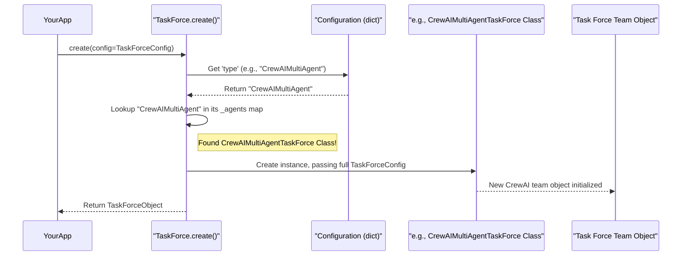

# Chapter 9: TaskForceFactory

Welcome to Chapter 9! In [Chapter 8: RAGPipelineComponents](08_ragpipelinecomponents_.md), we explored how to build systems that allow our AI to access and "read" external documents, significantly boosting its knowledge. Now, what if a task is so complex that a single AI agent, even with tools and RAG, isn't enough? What if we need a team of specialized AI agents working together?

This is where the **`TaskForceFactory`** concept comes into play! It's like a general contractor for AI projects.

## The Big Idea: Assembling AI Dream Teams

Imagine you need to complete a complex project, like building a house. You wouldn't hire just one person to do everything, right? You'd need a team: architects to design, builders to construct, electricians for wiring, plumbers for pipes, and a project manager to oversee it all. Each specialist focuses on their part, and they collaborate to achieve the final goal.

The `TaskForceFactory` (in our code, this is mainly handled by the `TaskForce` class and its `create` method) is responsible for assembling these specialized **teams of AI agents** (we call them "Task Forces") to collaborate on complex tasks. It defines:
*   **Who is on the team?** (Which AI agents, like a "Planner Agent," a "Research Agent," or a "Content Writer Agent").
*   **What are their roles and goals?** (What is each agent supposed to do?).
*   **What tasks are assigned to them?** (Specific instructions for each agent).
*   **How do they work together?** (Do they work one after another like an assembly line, or does a manager agent coordinate specialists?).

This allows us to build sophisticated multi-agent workflows to tackle problems that are too big or too diverse for a single AI brain.

**Use Case: Writing a Research Report**

Let's say we want our AI system to create a research report on "The Impact of Renewable Energy on Climate Change." This is a complex task! A single AI might struggle to research, outline, write, and review effectively.

A `TaskForce` approach would be better:
1.  **Researcher Agent**: Gathers information, finds relevant studies, and collects data.
2.  **Writer Agent**: Takes the research findings and writes the report content, ensuring it's coherent and well-structured.
3.  **Reviewer Agent**: Checks the report for accuracy, clarity, and completeness.

These agents would work together, possibly sequentially (researcher -> writer -> reviewer), to produce the final report. The `TaskForceFactory` helps us set up and manage this team.

## Key Concepts of a Task Force

1.  **Agents**: These are individual AI "workers," each configured with a specific role, goal, and potentially a unique set of tools (from [Chapter 7: ToolManagement](07_toolmanagement_.md)) and a language model (from [Chapter 4: ChatModelFactory](04_chatmodelfactory_.md)).
2.  **Tasks**: These are specific assignments given to agents. A task usually has a description of what needs to be done and an expected outcome.
3.  **Process/Plan Type**: This defines how the agents in the task force collaborate. Common processes include:
    *   **Sequential (`Process.sequential`)**: Agents work one after another. Agent A completes its task, then Agent B starts with Agent A's output, and so on.
    *   **Hierarchical (`Process.hierarchical`)**: A manager agent oversees other specialist agents, delegating tasks and synthesizing their outputs. (This is common in frameworks like CrewAI).
    *   **Graph-based**: Agent interactions are defined as a graph, allowing for more complex, non-linear workflows (common in frameworks like LangGraph).

## How to Create and Use a Task Force

Let's use our "Research Report" use case. We'll aim to create a simplified two-agent team (Researcher and Writer) using a CrewAI-style setup, as it's quite intuitive for defining roles.

**1. Prepare the Configuration:**
We need to tell the `TaskForce` factory what kind of team we want, who's on it, and what they should do. This is done with a Python dictionary, typically loaded from a YAML file managed by [PlatformConfiguration](01_platformconfiguration_.md).

```python
# Configuration for a CrewAI-style Task Force
report_writing_task_force_config = {
    "type": "CrewAIMultiAgent",  # Tells the factory to use CrewAI
    "plan_type": "Sequential",   # Agents work one after the other
    "llm": { # Configuration for the LLM all agents will use
        "type": "LangChainChatOpenAI", 
        "api_key": "$ENV{OPENAI_API_KEY}", 
        "model_name": "gpt-3.5-turbo"
    },
    "tasks": [
        { # Task 1: Research
            "description": "Gather comprehensive information on the impact of renewable energy on climate change.",
            "expected_output": "A summary of key findings, data points, and sources.",
            "agent": {
                "role": "Senior Research Analyst",
                "goal": "Uncover factual and relevant information for the report.",
                "backstory": "An expert researcher with a knack for finding critical data."
                # "tools": [] # Could list tools here
            }
        },
        { # Task 2: Writing
            "description": "Write a compelling research report based on the provided findings.",
            "expected_output": "A well-structured and informative report.",
            "agent": {
                "role": "Professional Content Writer",
                "goal": "Craft an engaging and clear report from the research data.",
                "backstory": "A skilled writer known for making complex topics understandable."
            }
        }
    ]
}
```
*   `"type": "CrewAIMultiAgent"`: Specifies that we want to use the CrewAI framework for our multi-agent system.
*   `"plan_type": "Sequential"`: The Researcher will complete its task, and its output will be passed to the Writer.
*   `"llm"`: Defines the language model (from [Chapter 4: ChatModelFactory](04_chatmodelfactory_.md)) that the agents in this task force will use.
*   `"tasks"`: A list defining each step.
    *   Each task has a `description`, an `expected_output`, and an `agent` assigned to it.
    *   Each `agent` has a `role`, `goal`, and `backstory` (CrewAI uses these to help the LLM embody the agent persona). They can also have `tools`.

**2. Ask the Factory to Create the Task Force:**
Now, we use the `TaskForce.create()` method from `lib/services/agents/task_force.py`.

```python
from src.lib.services.agents.task_force import TaskForce

# Assume report_writing_task_force_config is defined as above
# and OPENAI_API_KEY is set in your environment

try:
    # The factory creates the specific task force instance
    report_team = TaskForce.create(config=report_writing_task_force_config)
    print("Successfully created the Research Report Task Force!")
except ValueError as e:
    print(f"Error creating task force: {e}")
```
If successful, `report_team` now holds an instance of `CrewAIMultiAgentTaskForce` (or whatever type was specified), fully configured with our agents and tasks.

**3. Run the Task Force:**
Let's kick off the report writing process. The input here could be the main topic or initial instructions.

```python
# Assume 'report_team' is our created TaskForce instance
initial_input = "Create a report on: The Impact of Renewable Energy on Climate Change."

# The run method starts the agents working together
result = report_team.run(message=initial_input)

if result.status == "success":
    print("\n--- Task Force Completed ---")
    print(f"Final Report (or summary):\n{result.completion}")
else:
    print(f"\n--- Task Force Failed ---")
    print(f"Error: {result.error_message}")
```

**Expected Outcome (Conceptual):**
The `result.completion` would ideally contain the final research report generated by the Writer Agent, after the Researcher Agent provided its findings.
```
--- Task Force Completed ---
Final Report (or summary):
[A well-written report on the impact of renewable energy, based on simulated research and writing steps by the AI agents.]
```
Behind the scenes, the "Senior Research Analyst" agent would first execute its task using the LLM. Its output (the "summary of key findings") would then become input for the "Professional Content Writer" agent, who would then execute its task to produce the final report.

## Under the Hood: The General Contractor at Work

When you call `TaskForce.create(config)`:

1.  **Receive Blueprint**: Your application calls `TaskForce.create()` with the configuration dictionary (the "blueprint" for your AI team).
2.  **Identify Team Type**: The `create()` method looks at the `"type"` key in your `config` (e.g., `"CrewAIMultiAgent"`).
3.  **Consult Roster of Team Leaders**: `TaskForce` has an internal "roster" – a Python dictionary named `_agents`. This roster maps team type names (like `"CrewAIMultiAgent"`) to the actual Python classes that know how to manage that specific kind of multi-agent system (e.g., `CrewAIMultiAgentTaskForce` class).
4.  **Assemble the Team**: If it finds a matching class in its roster, it creates a new instance (an object) of that class. Crucially, it passes the *entire* `config` dictionary to the constructor of that specific task force class (e.g., `CrewAIMultiAgentTaskForce(config)`).
5.  **Team Ready**: The newly created, fully configured task force object is returned.

Here's a simplified diagram of this flow:



### Code Dive: The `TaskForce` Factory Class

Let's look at the `TaskForce` class from `lib/services/agents/task_force.py`. This is our "general contractor" or factory.

```python
# Simplified from lib/services/agents/task_force.py
from typing import Type, Dict, Any
# Import actual classes for specific task force types
from src.lib.services.agents.task_forces.crewai.crew import (
    CrewAIMultiAgentTaskForce)
from src.lib.services.agents.task_forces.langgraph.state_graph import (
    LangGraphAgentTaskForce)

class TaskForce:
    # The "_agents" roster: maps type string to actual Python class
    _agents: Dict[str, Type] = {
        'CrewAIMultiAgent': CrewAIMultiAgentTaskForce,
        'LangGraphMultiAgent': LangGraphAgentTaskForce,
    }

    @staticmethod
    def create(config: dict) -> Any: # Returns an instance of some task force
        agents_type = config.get('type')
        if not agents_type:
            raise ValueError("Configuration must include 'type'.")
        
        agents_class = TaskForce._agents.get(agents_type)
        if not agents_class:
            raise ValueError(f"Unsupported task force type: {agents_type}")
        
        # Create an instance of the found class, passing the config to it.
        return agents_class(config)
```
*   `_agents`: This dictionary is the "roster." It maps a string like `'CrewAIMultiAgent'` to the Python class `CrewAIMultiAgentTaskForce` that handles setting up a CrewAI-based team.
*   `create(config)`: This static method does the main assembly.
    1.  It gets the `type` from the `config`.
    2.  It looks up the corresponding class in `_agents`.
    3.  It then creates an instance of that class by calling `agents_class(config)`, passing the configuration dictionary directly to the specific task force's constructor. This pattern should feel familiar from previous chapters!

### The Blueprint: `BaseTaskForce`

All specific task force classes (like `CrewAIMultiAgentTaskForce` or `LangGraphAgentTaskForce`) are built from a common blueprint: `BaseTaskForce` (from `lib/services/agents/task_forces/base.py`). This ensures consistency.

```python
# Simplified from lib/services/agents/task_forces/base.py
import abc
from pydantic import BaseModel, Field # For structured configuration
from typing import Optional, Any, Dict, List

class BaseTaskForce(abc.ABC):
    class ConfigAgent(BaseModel): # Inner Pydantic model for Agent config
        role: str
        goal: str
        tools: Optional[List[Any]] = []
        # ... other agent fields ...

    class ConfigTask(BaseModel): # Inner Pydantic model for Task config
        description: str
        agent: "BaseTaskForce.ConfigAgent" # Link to agent config
        # ... other task fields ...

    class Config(BaseModel): # Main Pydantic model for TaskForce config
        type: str
        plan_type: str
        tasks: List["BaseTaskForce.ConfigTask"]
        llm: Optional[Dict[str, Any]] = None # LLM config
        verbose: Optional[bool] = True

    class Result(BaseModel): # Pydantic model for the run() output
        status: str = "success"
        completion: Optional[str] = None
        error_message: Optional[str] = None
        
    @abc.abstractmethod # Specific task forces MUST implement this
    def run(self, message: str) -> 'BaseTaskForce.Result':
        pass
```
*   **Pydantic Models (`Config`, `ConfigTask`, `ConfigAgent`, `Result`)**: These define the expected structure for configurations and results. When `CrewAIMultiAgentTaskForce(config)` is called, it uses its own Pydantic `Config` model (which extends/uses these base models) to parse and validate the incoming `config` dictionary. This ensures all necessary details (like agent roles, task descriptions, LLM settings) are provided correctly.
*   **`run(self, message: str)`**: This is an abstract method. `BaseTaskForce` doesn't know *how* to run a CrewAI team or a LangGraph setup. It just declares that any *concrete* task force class *must* provide its own `run` method. This is the method you call to kick off the team's work.

### A Specific Team Manager: `CrewAIMultiAgentTaskForce` (Brief Look)

When `TaskForce.create()` calls `CrewAIMultiAgentTaskForce(config)`, its `__init__` method (from `lib/services/agents/task_forces/crewai/crew.py`) gets to work:

```python
# Simplified from lib/services/agents/task_forces/crewai/crew.py
from crewai import Agent, Crew, Task, Process # CrewAI library components
from src.lib.services.chat.model import ChatModel # From Chapter 4

class CrewAIMultiAgentTaskForce(BaseTaskForce):
    # It has its own Pydantic Config models that extend BaseTaskForce.Config...
    
    def __init__(self, config: Dict[str, Any]):
        # 1. Validate and store configuration using its Pydantic Config model
        self.config = CrewAIMultiAgentTaskForce.Config(**config)
        # self.result = CrewAIMultiAgentTaskForce.Result() # Prepare result obj
        
        # 2. Initialize the LLM for the agents
        # self.llm = self._init_llm() # Calls ChatModel.create(self.config.llm)
        
        # 3. Initialize the CrewAI crew
        # self.crew = self._init_crew() # Sets up Agents and Tasks using CrewAI classes
        logger.info(f"CrewAI Task Force '{self.config.type}' initialized.")

    # _init_llm uses ChatModel.create() from Chapter 4
    # _init_crew uses self.config.tasks to create CrewAI Agent and Task objects
    # and then assembles them into a CrewAI Crew object with the specified process.

    def run(self, message: Optional[Union[str, Dict[str, Any]]]) -> BaseTaskForce.Result:
        # try:
        #   input_data = {"request": message} # if message is string
        #   response = self.crew.kickoff(inputs=input_data) # Starts CrewAI
        #   self.result.completion = response.raw 
        #   # ... set status, etc.
        # except Exception as e:
        #   # ... handle error ...
        # return self.result
        pass # Actual implementation details omitted for brevity
```
*   The `__init__` method receives the `config_dict` from the factory.
*   It uses its Pydantic `Config` model (which is more specific than `BaseTaskForce.Config` but compatible) to validate all the settings.
*   `_init_llm()`: It sets up the shared language model for all agents in the crew using the `llm` part of the configuration and the [ChatModelFactory](04_chatmodelfactory_.md).
*   `_init_crew()`: This is where the magic happens for CrewAI. It iterates through `self.config.tasks`:
    *   For each task's `agent` configuration, it creates a CrewAI `Agent` object (setting its role, goal, backstory, LLM, tools).
    *   For each `task` configuration, it creates a CrewAI `Task` object (setting its description, expected output, and assigning the just-created agent).
    *   Finally, it assembles all these `Agent` and `Task` objects into a CrewAI `Crew` object, specifying the `process` (e.g., `Process.sequential`).
*   The `run()` method then simply calls `self.crew.kickoff()` to start the team work.

A similar process happens for `LangGraphAgentTaskForce`, but it uses LangGraph's concepts of nodes (agents) and edges to build a state graph representing the workflow.

## Conclusion

The `TaskForceFactory` (via `TaskForce.create()`) provides a powerful and organized way to build and manage sophisticated multi-agent AI systems. By defining teams of specialized AI agents, their tasks, and how they collaborate, we can tackle complex problems that go beyond the capabilities of a single AI.

You've learned:
*   Why we need AI teams (Task Forces) for complex problems.
*   The key components: Agents, Tasks, and Process/Plan Type.
*   How to configure a Task Force, specifying agents, their roles, goals, tasks, and the collaboration process (e.g., using CrewAI).
*   How `TaskForce.create()` acts as a factory to assemble these teams based on your configuration.
*   The role of `BaseTaskForce` in providing a consistent structure.
*   A glimpse into how a specific implementation like `CrewAIMultiAgentTaskForce` sets up its team.

This modular approach, relying on clear configurations and a factory pattern, allows for flexibility. You can design different teams for different complex tasks, choosing frameworks like CrewAI or LangGraph based on the project's needs, all managed through a consistent interface.

Now that we have seen how different components of our `src` system can be configured and created, including tools that can be hosted as services, how do these different parts of a potentially distributed system talk to each other? We'll get a glimpse of that in the next and final chapter: [Chapter 10: MCPIntegration](10_mcpintegration_.md).

---

Generated by [AI Codebase Knowledge Builder](https://github.com/The-Pocket/Tutorial-Codebase-Knowledge)