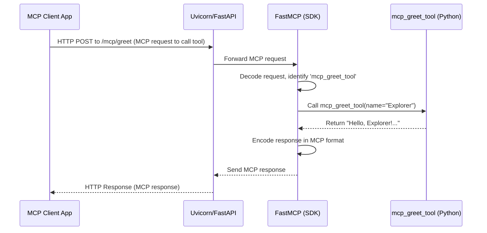
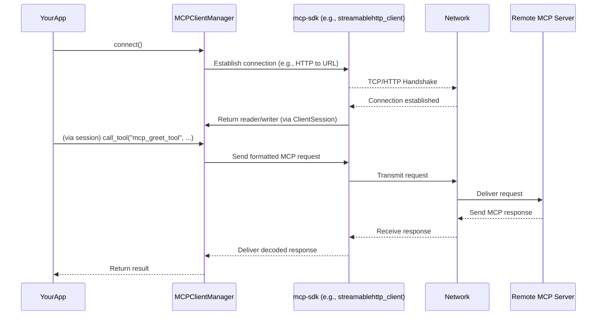

# Chapter 10: MCPIntegration

Welcome to the final chapter of our core `src` tutorial! In [Chapter 9: TaskForceFactory](09_taskforcefactory_.md), we saw how to assemble teams of AI agents to tackle complex projects. Now, imagine these agents, or even different parts of our platform, need to talk to other software, perhaps even software running on different computers. How do they communicate effectively, especially if they weren't originally designed to work together?

This is where **MCPIntegration** steps in! MCP stands for **Model Context Protocol**. Think of it as a friendly, multilingual diplomat and universal translator for software services. It helps different applications and tools understand each other and work together smoothly.

## The Big Idea: Software Diplomacy with MCP

Let's say our platform has an amazing capability, like a super-smart function that can summarize any text. Another application, maybe a note-taking app, would love to use this summarization feature.
*   **Without MCP**: The note-taking app would need to learn the specific, custom way our platform expects to receive text and how it sends back summaries. If we change our platform, the note-taking app might break!
*   **With MCP**: Our platform can offer its summarization service using the MCP "language." The note-taking app, if it also understands MCP, can easily use our service. It's like both apps agree to speak a common language.

MCPIntegration in our `src` project provides three key roles for this:

1.  **`MCPServer` (The Service Host)**: This allows our platform to **offer its capabilities** to others. Our summarization service can become an `MCPServer`, making its features available to any MCP-compliant system. It's like setting up a "service booth" at a tech fair, advertising what you can do.
2.  **`MCPClient` (The Service Consumer)**: This lets our platform **connect to and use services** from other MCP servers. If there's an external weather service that speaks MCP, our platform can use `MCPClient` to ask it for the weather. It's like visiting another service booth to use their offerings.
3.  **`MCPRegistry` (The Directory)**: This acts like a **"Yellow Pages" or an event directory** for MCP servers. It keeps track of available servers and what they can do. This helps clients find the services they need.

Let's see how we can set up our platform to offer a simple service using `MCPServer`, then use `MCPClient` to interact with it, and finally, how `MCPRegistry` helps manage these services.

## Offering a Service with `MCPServer`

Imagine we have a simple Python function we want to offer as a service:
```python
# Our amazing function
def greet_user(name: str) -> str:
    """Greets the user by name."""
    return f"Hello, {name}! Welcome to our MCP service."
```
We want other applications to be able to call this function.

**1. Configure the `MCPServer`:**
We need to tell the `MCPServer` how to run. We'll use a simple HTTP-based transport (specifically, Streamable HTTP which uses FastAPI, similar to what we saw in [Chapter 2: ChatAPIEndpoint](02_chatapiendpoint_.md)).

```python
# Configuration for our greeting MCPServer
server_config = {
    "name": "GreetingService",        # A name for our server
    "transport": "streamable",       # Use HTTP
    "host": "localhost",
    "port": 8001,                    # Port it will listen on
    "mount_path": "/mcp/greet"       # Web path for the service
}
```

**2. Create and Set Up the `MCPServerManager`:**
The `MCPServer` class acts as a factory, providing an `MCPServerManager` instance.
```python
from src.lib.services.mcp import MCPServer # Simplified import

# Create the server manager instance using the factory
try:
    server_manager = MCPServer.create(config=server_config)
    print(f"MCPServerManager for '{server_manager.name}' created.")
except ValueError as e:
    print(f"Error creating server: {e}")
```
This creates an `MCPServerManager` which will manage our `GreetingService`.

**3. Register Our Function as a Tool:**
The `MCPServerManager` uses decorators to easily expose functions as "tools" that MCP clients can call.
```python
# Assuming 'server_manager' exists

@server_manager.register_tool(description="Greets the user.")
def mcp_greet_tool(name: str) -> str: # The function clients will call
    return greet_user(name) # Calls our original function

print(f"Tool 'mcp_greet_tool' registered on {server_manager.name}.")
```
Now, our `greet_user` logic is available as `mcp_greet_tool` on the `GreetingService` server.

**4. Start the Server:**
This needs to be run in an environment that supports `asyncio`, Python's way of handling asynchronous operations (like waiting for network requests).
```python
import asyncio

async def main_server_start():
    # Assuming 'server_manager' exists and tool is registered
    result = await server_manager.start()
    if result.status == "success":
        print(f"{server_manager.name} started on port {server_config['port']}.")
        # Keep server running (in a real app, this would be managed)
        # For this example, we'll let it run for a bit if not in stdio
        if server_manager.transport != "stdio":
            await asyncio.sleep(60) # Keep alive for 60s to test client
            await server_manager.stop()
            print(f"{server_manager.name} stopped.")
    else:
        print(f"Failed to start {server_manager.name}: {result.error_message}")

# To run this in a Jupyter notebook or script:
# asyncio.run(main_server_start())
```
If you run this, your `GreetingService` will be live on `http://localhost:8001/mcp/greet`, ready to accept MCP requests! (You'd need to run client code in a separate script/notebook or after the server has started and is kept alive).

## Using a Service with `MCPClient`

Now, let's build an `MCPClient` to talk to the `GreetingService` we just started.

**1. Configure the `MCPClient`:**
The client needs to know where the server is.
```python
# Configuration for our MCPClient
client_config = {
    "name": "GreetingClient",         # A name for this client setup
    "transport": "streamable",        # Must match server's transport
    "url": "http://localhost:8001/mcp/greet" # Server's address
}
```

**2. Create the `MCPClientManager`:**
Similar to the server, `MCPClient` is a factory.
```python
from src.lib.services.mcp import MCPClient # Simplified import

try:
    client_manager = MCPClient.create(config=client_config)
    print(f"MCPClientManager '{client_manager.name}' created.")
except ValueError as e:
    print(f"Error creating client: {e}")
```

**3. Connect and Call the Tool:**
We use an `async with` block to manage the connection.
```python
import asyncio

async def main_client_call():
    # Assuming 'client_manager' exists
    try:
        async with client_manager.connect() as session: # Connect to server
            await session.initialize() # Handshake with the server
            
            # Call the tool 'mcp_greet_tool' with argument 'name'
            tool_name = "mcp_greet_tool"
            args = {"name": "Explorer"}
            
            print(f"Calling tool '{tool_name}' with args: {args}")
            mcp_response = await session.call_tool(tool_name, args)
            
            # MCP responses often wrap content, let's extract it
            # The structure might vary slightly based on mcp-sdk version
            actual_content = "Could not extract content"
            if hasattr(mcp_response, 'content') and mcp_response.content:
                if isinstance(mcp_response.content, list) and len(mcp_response.content) > 0:
                    first_content_item = mcp_response.content[0]
                    if hasattr(first_content_item, 'text'):
                        actual_content = first_content_item.text
                    else: # Fallback if no .text attribute
                        actual_content = str(first_content_item)
                else: # Fallback if content is not a list
                    actual_content = str(mcp_response.content)

            print(f"Response from {tool_name}: {actual_content}")
            
    except Exception as e:
        print(f"Error calling tool: {e}")

# To run this (ensure server is running from previous step):
# asyncio.run(main_client_call())
```
**Expected Output (if server is running):**
```
MCPClientManager 'GreetingClient' created.
Calling tool 'mcp_greet_tool' with args: {'name': 'Explorer'}
Response from mcp_greet_tool: Hello, Explorer! Welcome to our MCP service.
```
Our client successfully called the `mcp_greet_tool` on our `GreetingService`!

## Keeping Track with `MCPRegistry`

If you have many MCP services, how do clients find them? That's where `MCPRegistry` helps. It's like a phone book for MCP services.

**1. Configure the `MCPRegistry`:**
The registry needs a place to store its listings, usually a JSON file.
```python
registry_config = {
    "registry_file": "my_mcp_services.json", # File to store listings
    "cache_ttl": 300  # How long to cache discovered capabilities (in seconds)
}
```

**2. Create the Registry Instance:**
```python
from src.lib.services.mcp import MCPRegistry # Simplified import

mcp_directory = MCPRegistry(config=registry_config)
print("MCPRegistry created.")
```

**3. Register Our Server's Details:**
We tell the registry about our `GreetingService`.
```python
# Details of our GreetingService
greeting_server_details = {
    "name": "GreetingService", # Must match server_config's name
    "transport": "streamable",
    "url": "http://localhost:8001/mcp/greet", # Its address
    "description": "A friendly service that greets users.",
    "enabled": True
}
mcp_directory.register_server(server_config=greeting_server_details)
print(f"'{greeting_server_details['name']}' registered in MCPRegistry.")
```
This saves the server's info into `my_mcp_services.json`.

**4. Discovering Capabilities via Registry:**
A client can now ask the registry about the `GreetingService` and what tools it offers. The registry will use an `MCPClient` internally to talk to the registered server and find out its capabilities.
```python
import asyncio

async def main_registry_discover():
    # Assuming 'mcp_directory' and 'GreetingService' is registered and running
    server_name = "GreetingService"
    print(f"Asking registry to discover capabilities for '{server_name}'...")
    
    capabilities = await mcp_directory.discover_capabilities(server_name=server_name)
    
    if capabilities:
        print(f"\nCapabilities for '{server_name}':")
        for tool in capabilities.get('tools', []):
            print(f"  - Tool: {tool.get('name')}, Desc: {tool.get('description')}")
    else:
        print(f"Could not discover capabilities for '{server_name}'. Is it running?")

# To run this (ensure server is running and registered):
# asyncio.run(main_registry_discover())
```
**Expected Output (if server is running):**
```
MCPRegistry created.
'GreetingService' registered in MCPRegistry.
Asking registry to discover capabilities for 'GreetingService'...

Capabilities for 'GreetingService':
  - Tool: mcp_greet_tool, Desc: Greets the user.
```
The `MCPRegistry` successfully contacted our `GreetingService` (using an internal `MCPClient`), found out about `mcp_greet_tool`, and reported it back. This is very useful for dynamic service discovery.

## Under the Hood: A Peek at the Mechanisms

### `MCPServer`
When you create and start an `MCPServer`:
1.  **Factory (`MCPServer.create`)**: Takes your `config`, checks the `transport` type, and creates an `MCPServerManager` instance.
2.  **`MCPServerManager`**: This manager initializes an instance of `FastMCP` from the `mcp-sdk` library. `FastMCP` is the core engine that understands the MCP protocol.
3.  **Tool Registration (`@server_manager.register_tool`)**: This decorator calls `self.mcp.tool()` (from `FastMCP`), effectively telling `FastMCP` about your Python function, its name, and description.
4.  **Starting (`server_manager.start()`)**:
    *   For HTTP transports like `"streamable"`, it sets up a web server (like Uvicorn with FastAPI/Starlette). `FastMCP` provides the necessary web application components (e.g., `self.mcp.streamable_http_app()`).
    *   This web server then listens for incoming HTTP requests at the specified `mount_path`.
5.  **Handling a Request**:
    *   An MCP client sends a request (e.g., to call `mcp_greet_tool`).
    *   The web server passes it to `FastMCP`.
    *   `FastMCP` decodes the MCP message, finds the registered `mcp_greet_tool` function, and calls it with the provided arguments.
    *   The function's return value is packaged into an MCP response and sent back.



### `MCPClient`
When you use `MCPClient`:
1.  **Factory (`MCPClient.create`)**: Takes your `config` and creates an `MCPClientManager`.
2.  **Connection (`client_manager.connect()`)**:
    *   The `MCPClientManager` looks at `config.transport` (e.g., `"streamable"`) and `config.url`.
    *   It uses a specific client function from the `mcp-sdk` (e.g., `streamablehttp_client(...)`) to establish a connection. This function returns a "reader" and "writer" that understand how to send/receive MCP messages over that transport.
    *   An `mcp.ClientSession` is created with this reader and writer.
3.  **Calling a Tool (`session.call_tool(...)`)**:
    *   The `ClientSession` formats your tool name and arguments into a standard MCP request message.
    *   It uses the "writer" to send this message to the server.
    *   It then uses the "reader" to wait for and receive the server's MCP response message.
    *   The response is decoded and returned.



### `MCPRegistry`
When you use `MCPRegistry`:
1.  **Initialization**: Reads its `registry_file` (e.g., `my_mcp_services.json`) to load details of previously registered servers. For each server, it can pre-create an `MCPClientManager`.
2.  **Registering (`mcp_directory.register_server(...)`)**: Adds or updates a server's configuration in its internal list (`self._servers`) and saves this list back to the `registry_file`.
3.  **Discovering Capabilities (`mcp_directory.discover_capabilities(...)`)**:
    *   Checks if it has valid cached capabilities for the server.
    *   If not (or if `force_refresh` is true), it gets the `MCPClientManager` for that server.
    *   It uses this client manager to connect to the actual MCP server and call standard MCP methods like `list_tools()`, `list_resources()`.
    *   The retrieved capabilities are cached (stored in `self._servers` with a timestamp) and saved to the `registry_file`.

The `MCPToLangChainAdapter` (from `lib/services/mcp/adapters/langchain_tools.py`), which we briefly touched upon in [Chapter 7: ToolManagement](07_toolmanagement_.md), uses `MCPRegistry` to find all available MCP servers and then uses `MCPClient` for each one to discover their tools. It then converts these MCP tool specifications into LangChain `StructuredTool` objects, making them usable by LangChain-based agents.

## Conclusion

**MCPIntegration** is a powerful suite that allows our `src` platform to be a good "citizen" in a world of diverse software services.
*   The **`MCPServer`** lets us share our unique capabilities with others by setting up "service booths."
*   The **`MCPClient`** lets us consume capabilities from other MCP-compliant services, effectively "visiting their booths."
*   The **`MCPRegistry`** acts as the event directory, helping everyone find who offers what.

By using the Model Context Protocol, our platform can communicate and collaborate effectively with a wide range of external tools and systems, making it more extensible and versatile. This ensures that our AI agents and services aren't isolated islands but can participate in a larger ecosystem of capabilities.

Congratulations! You've reached the end of this tutorial series on the core components of the `src` project. From foundational [PlatformConfiguration](01_platformconfiguration_.md) to sophisticated [TaskForceFactory](09_taskforcefactory_.md) and now cross-system communication with `MCPIntegration`, you've gained a solid understanding of how this platform is built. We hope this journey has been insightful and empowers you to explore, use, and even contribute to the `src` project!

---

Generated by [AI Codebase Knowledge Builder](https://github.com/The-Pocket/Tutorial-Codebase-Knowledge)