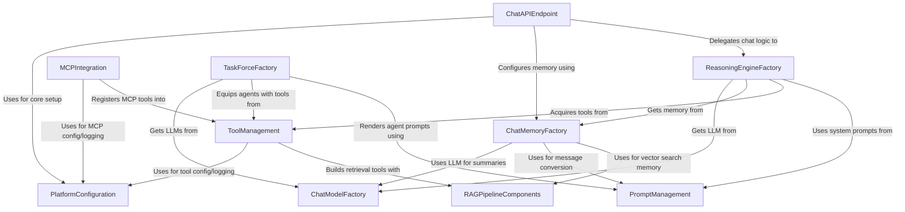

# Tutorial: src

This project is a platform for building **intelligent AI agents**. These agents can *chat*, *remember* past conversations, and use various *tools* to complete tasks. The platform allows for connecting to different **Large Language Models (LLMs)**, managing how agents access external knowledge through **Retrieval Augmented Generation (RAG)**, and even creating *teams of agents* that work together. It also supports communication with external services using **Model Context Protocol (MCP)** and provides a standard **API** for interacting with the agents.

**Source Repository:** [None](None)

## Chapters

1. [PlatformConfiguration
](01_platformconfiguration_.md)
2. [ChatAPIEndpoint
](02_chatapiendpoint_.md)
3. [ReasoningEngineFactory
](03_reasoningenginefactory_.md)
4. [ChatModelFactory
](04_chatmodelfactory_.md)
5. [PromptManagement
](05_promptmanagement_.md)
6. [ChatMemoryFactory
](06_chatmemoryfactory_.md)
7. [ToolManagement
](07_toolmanagement_.md)
8. [RAGPipelineComponents
](08_ragpipelinecomponents_.md)
9. [TaskForceFactory
](09_taskforcefactory_.md)
10. [MCPIntegration
](10_mcpintegration_.md)

---

Generated by [AI Codebase Knowledge Builder](https://github.com/The-Pocket/Tutorial-Codebase-Knowledge)